# Tianwen V2 Operational Flows

**Last Updated:** 2026-04-11

This document describes 15 end-to-end operational workflows. Each flow includes entry point, sequence diagram, key functions, state transitions, and file:line citations.

---

## Flow Overview

| #   | Flow               | Entry Point                 | Duration    | Data Changes                                           |
| --- | ------------------ | --------------------------- | ----------- | ------------------------------------------------------ |
| 1   | Bootstrap          | App cold-start              | ~5s (min)   | Init DB, seed data, check backup                       |
| 2   | Order Entry        | OrderPage commodity tap     | ~1–2m       | Create order, order_items, order_discounts, daily_data |
| 3   | Order Edit         | OrdersPage edit icon        | ~1–2m       | Delete/recreate items, discounts                       |
| 4   | Mark Served        | OrdersPage button           | ~1s         | Toggle is_served flag                                  |
| 5   | Clock-In/Out       | ClockInPage name tap        | ~10s        | Create/update attendance                               |
| 6   | Product Management | Settings > Products         | ~10s        | Update commodity, create price_change_logs             |
| 7   | Analytics          | AnalyticsPage               | ~2s (query) | Read daily_data, render charts                         |
| 8   | Manual Backup      | Settings > "Backup Now"     | ~30s        | Gzip DB, upload to R2, create backup_logs              |
| 9   | Auto-Backup        | useAutoBackup hook          | ~30s        | Check schedule, backup if overdue                      |
| 10  | Cloud Restore      | Settings > "Restore"        | ~30s        | Download, decompress, replace DB, reload               |
| 11  | V1→V2 Import       | First launch (legacy data)  | ~1m         | Transform, INSERT OR IGNORE                            |
| 12  | Staff Management   | Settings > Staff            | ~30s        | Add/edit/soft-delete employees                         |
| 13  | Google OAuth       | Staff card > "Link Google"  | ~10s        | Bind employee to Google account                        |
| 14  | Error Handling     | Any exception               | ~1s         | Log to error_logs, show ErrorOverlay                   |
| 15  | PWA Update         | Service Worker notification | ~5s         | Reload app with new code                               |

---

## Flow 1: Bootstrap (App Cold Start)

**Entry Point**: App load → React mounts RootLayout

**Duration**: 5+ seconds (minimum 5 seconds for InitOverlay display)

**Sequence**:

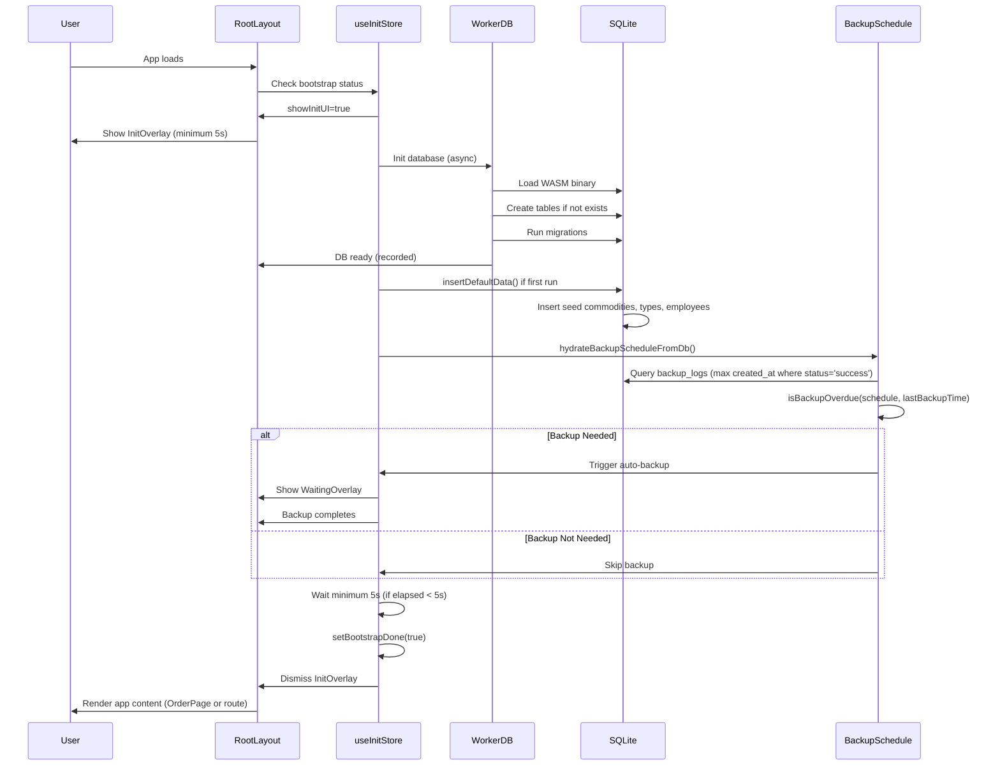

**Key Functions**:

- `src/stores/init-store.ts:66` — `setShowInitUI()` records shownAt timestamp
- `src/lib/worker-database.ts:initSchema()` — Creates tables, runs migrations
- `src/constants/default-data.ts` — insertDefaultData() seeds if VERSION_KEY not found
- `src/stores/backup-store.ts:62–84` — `hydrateBackupScheduleFromDb()` loads lastBackupTime
- `src/lib/backup-schedule.ts:56–84` — `isBackupOverdue()` determines if backup needed
- `src/hooks/use-auto-backup.ts` — Triggers auto-backup if overdue

**State Transitions**:

1. **Init Start**: `showInitUI=true`, `bootstrapDone=false`
2. **DB Ready**: `dbReady=true` (recorded but overlay still shown)
3. **Backup Checked**: Auto-backup triggered if needed
4. **Init Complete**: `bootstrapDone=true`, InitOverlay dismissed after min 5s
5. **App Ready**: Normal app content rendered

**File:Line Citations**:

- `src/main.tsx` — App entry point
- `src/routes/route-tree.tsx:60–95` — RootLayout component
- `src/stores/init-store.ts` — InitStore definition
- `src/lib/worker-database.ts` — Database initialization
- `src/lib/schema.ts:479–485` — initSchema function
- `src/constants/default-data.ts` — seed data

**Testing**:

- ✓ Bootstrap flow with DB ready < 5s (InitOverlay still shown)
- ✓ Bootstrap with auto-backup overdue (backup triggered)
- ✓ Bootstrap with V1 legacy data (import triggered)

---

## Flow 2: Order Entry & Submission

**Entry Point**: OrderPage component → User taps commodity

**Duration**: 1–3 minutes (depending on items and discounts)

**Sequence**:

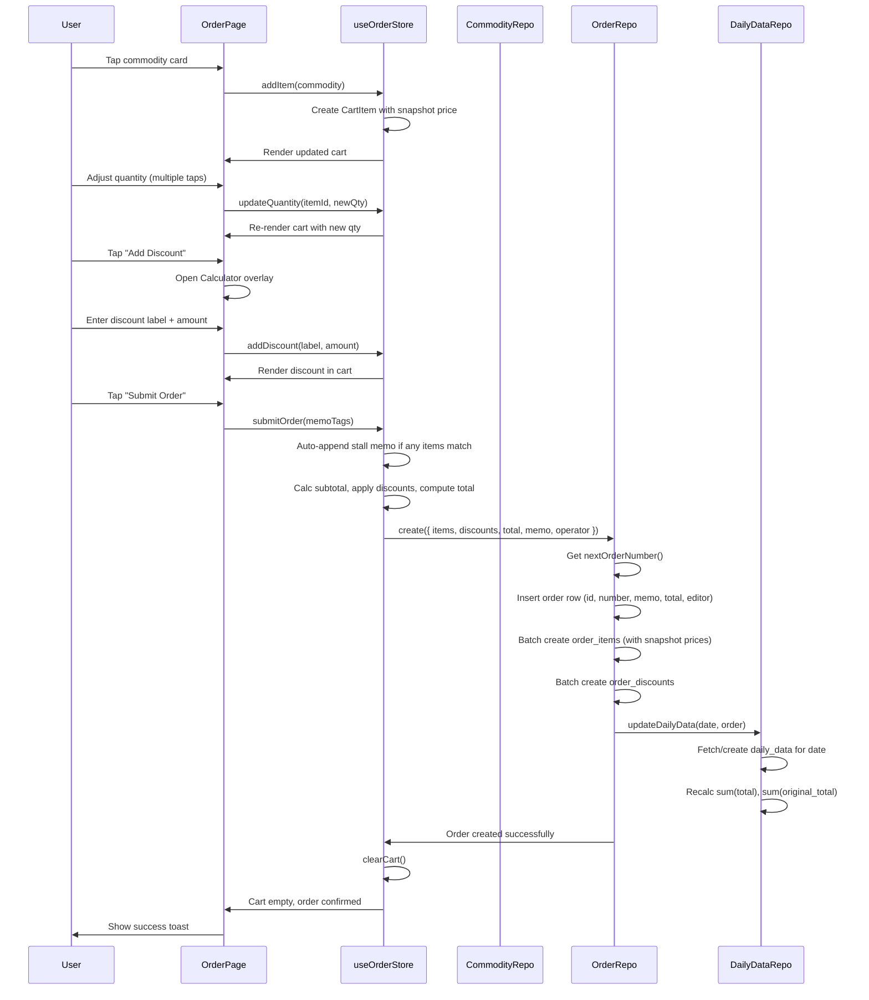

**Key Functions**:

- `src/stores/order-store.ts:41–95` — OrderStore (addItem, submitOrder, clearCart)
- `src/lib/repositories/order-repository.ts:create()` — Create order with items/discounts
- `src/lib/repositories/order-item-repository.ts:createBatch()` — Insert line items with snapshot price
- `src/lib/repositories/order-discount-repository.ts:createBatch()` — Insert discounts
- `src/lib/repositories/daily-data-repository.ts:updateDailyData()` — Aggregate daily revenue

**Business Rules Enforced**:

- Rule 1: Stall auto-memo (src/stores/order-store.ts:82–95)
- Rule 4: Snapshot price protection (src/stores/order-store.ts:63–69)
- Rule 7: Order number sequence (src/lib/repositories/order-repository.ts)

**State Transitions**:

1. **Items Added**: Cart accumulates commodities with snapshot prices
2. **Discounts Applied**: Manual discounts added to cart
3. **Submit Initiated**: submitOrder() called with cart state
4. **Order Created**: DB rows inserted (order, order_items, order_discounts)
5. **Daily Data Updated**: Aggregated totals for analytics
6. **Cart Cleared**: useOrderStore reset for next order

**File:Line Citations**:

- `src/pages/order/order-page.tsx` — UI component
- `src/stores/order-store.ts` — State management
- `src/lib/repositories/order-repository.ts` — Data persistence
- `src/lib/repositories/order-item-repository.ts` — Line items
- `src/lib/repositories/order-discount-repository.ts` — Discounts

**Testing**:

- ✓ Order with multiple items and discounts
- ✓ Stall auto-memo tagging (items with typeId="stall")
- ✓ Snapshot price (commodity price change after order doesn't affect order)
- ✓ Order number sequence (orders numbered 1, 2, 3…)

---

## Flow 3: Order Edit

**Entry Point**: OrdersPage → Order card → "Edit" button

**Duration**: 1–2 minutes

**Sequence**:

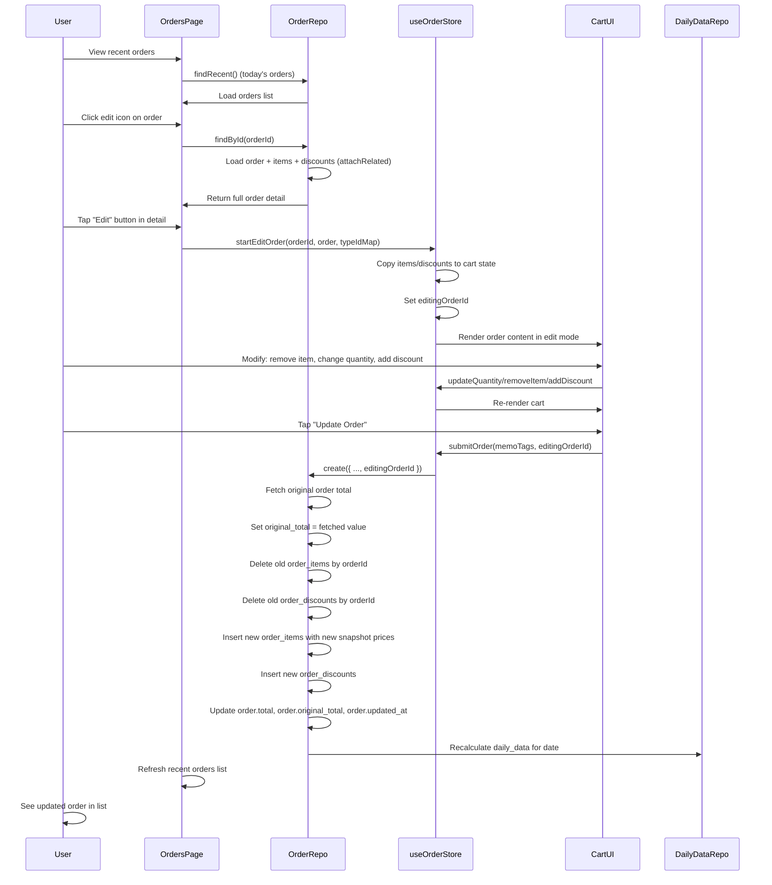

**Key Functions**:

- `src/lib/repositories/order-repository.ts:findById()` — Load full order with relations
- `src/stores/order-store.ts:startEditOrder()` — Copy order into cart
- `src/lib/repositories/order-item-repository.ts:removeByOrderId()` — Delete old items
- `src/lib/repositories/order-discount-repository.ts:removeByOrderId()` — Delete old discounts

**Business Rules Enforced**:

- Rule 4: Snapshot price (new items get current price, old items deleted)
- Rule 12: Order edit (original items deleted, new ones created; original_total preserved)

**State Transitions**:

1. **Load Order**: Fetch full order with items/discounts
2. **Enter Edit Mode**: Copy to cart, set editingOrderId
3. **Modify**: User changes items/discounts in cart
4. **Save Edit**: Old items/discounts deleted, new ones created
5. **Preserve History**: original_total shows pre-edit state
6. **Daily Data Recalc**: Aggregates updated

**File:Line Citations**:

- `src/pages/orders/orders-page.tsx` — UI
- `src/lib/repositories/order-repository.ts` — findById, create (edit mode)
- `src/stores/order-store.ts:startEditOrder()` — Edit init

**Testing**:

- ✓ Edit adds items to order
- ✓ Edit removes items from order
- ✓ original_total preserved, updated_at changed
- ✓ Daily revenue recalculated correctly

---

## Flow 4: Order Served Marking

**Entry Point**: OrdersPage → Order card → "Mark as Served"

**Duration**: <1 second

**Sequence**:

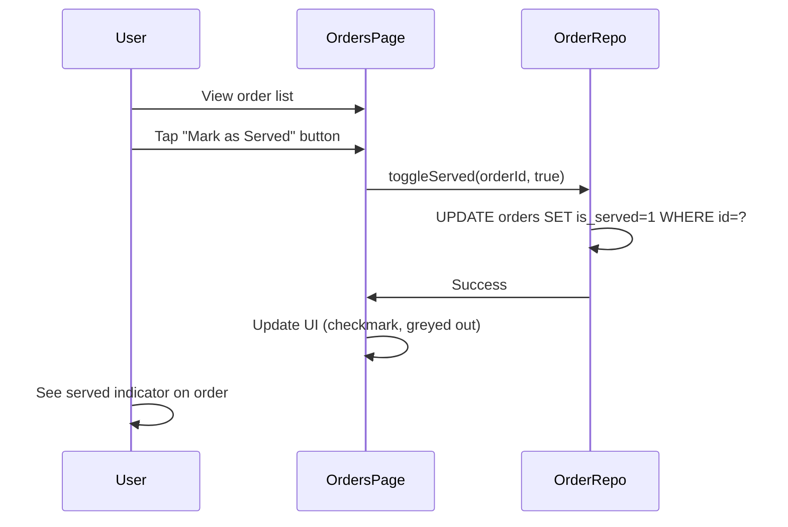

**Key Functions**:

- `src/lib/repositories/order-repository.ts:toggleServed()` — Toggle flag

**State Transitions**:

1. **User Taps**: toggleServed called
2. **DB Update**: is_served flag set to 1
3. **UI Update**: Order card shows "served" visual indicator

**File:Line Citations**:

- `src/lib/repositories/order-repository.ts:toggleServed()`

---

## Flow 5: Clock-In/Clock-Out

**Entry Point**: ClockInPage → Employee name card

**Duration**: 10–20 seconds (including confirmation)

**Sequence**:

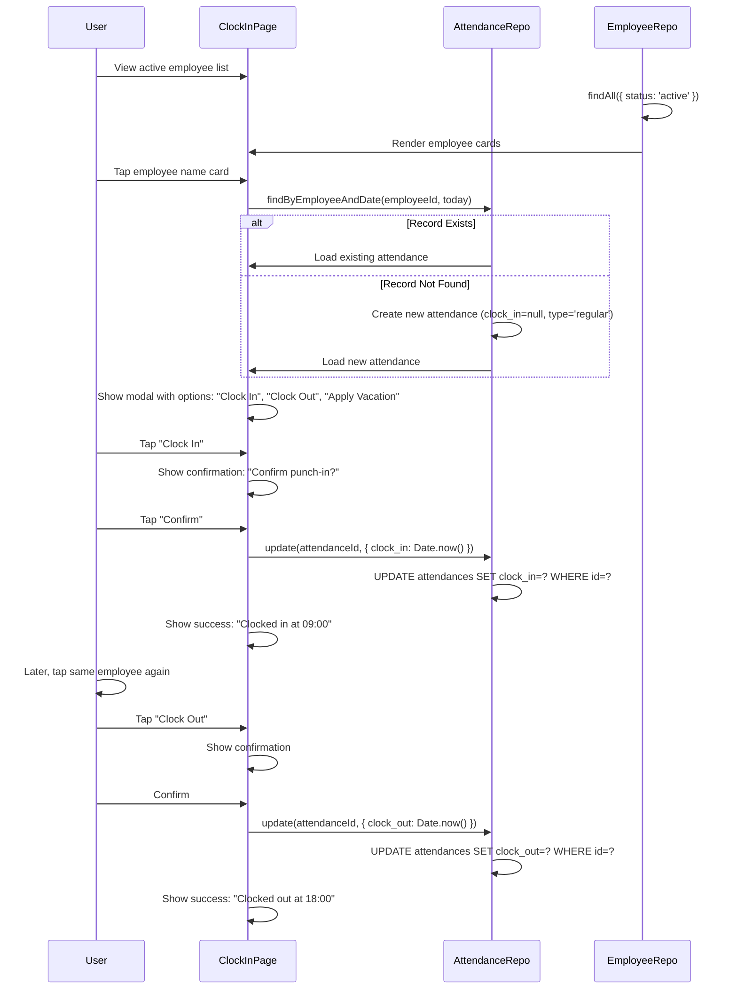

**Key Functions**:

- `src/lib/repositories/attendance-repository.ts:findByEmployeeAndDate()` — Load today's record
- `src/lib/repositories/attendance-repository.ts:create()` — Create if not exists
- `src/lib/repositories/attendance-repository.ts:update()` — Update clock times

**Business Rules Enforced**:

- Rule 6: Employee soft-delete (only active employees shown)

**State Transitions**:

1. **Card Tapped**: Load attendance record for employee + date
2. **Options Shown**: Clock in, clock out, or vacation
3. **Confirm Action**: User confirms punch in/out
4. **Timestamp Recorded**: DB updated with Unix timestamp
5. **Success Shown**: Toast message displays time

**File:Line Citations**:

- `src/pages/clock-in/clock-in-page.tsx` — UI
- `src/lib/repositories/attendance-repository.ts` — Persistence

**Testing**:

- ✓ Clock in records timestamp
- ✓ Clock out records timestamp
- ✓ Applying vacation sets type='paid_leave'
- ✓ Active employees only shown

---

## Flow 6: Product Management & Price Edit

**Entry Point**: Settings → Product Management

**Duration**: 10–30 seconds per item

**Sequence**:

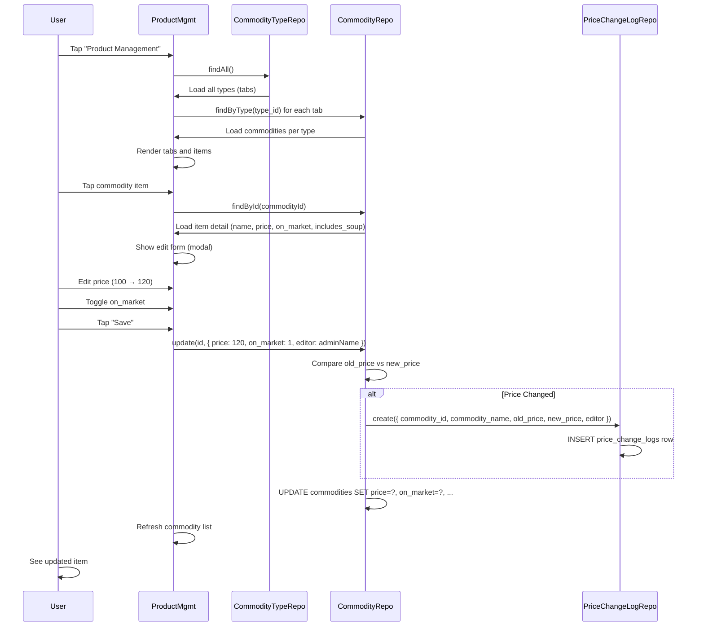

**Key Functions**:

- `src/lib/repositories/commodity-repository.ts:update()` — Update commodity + trigger price log
- `src/lib/repositories/price-change-log-repository.ts:create()` — Create audit entry

**Business Rules Enforced**:

- Rule 4: Snapshot price (old orders unaffected by new price)

**State Transitions**:

1. **Load Categories**: Fetch all commodity types
2. **Load Items**: Fetch commodities per type
3. **Select Item**: User taps to edit
4. **Edit Form**: Show current values
5. **Save**: Update DB, create price log if price changed
6. **List Refresh**: Display updated commodity

**File:Line Citations**:

- `src/pages/settings/product-management.tsx` — UI
- `src/lib/repositories/commodity-repository.ts:update()`
- `src/lib/repositories/price-change-log-repository.ts`

**Testing**:

- ✓ Price change creates price_change_logs entry
- ✓ on_market toggle hides/shows item in OrderPage
- ✓ Old orders retain original prices

---

## Flow 7: Analytics Page

**Entry Point**: Navigation → Analytics tab

**Duration**: 2–5 seconds (query + render)

**Sequence**:

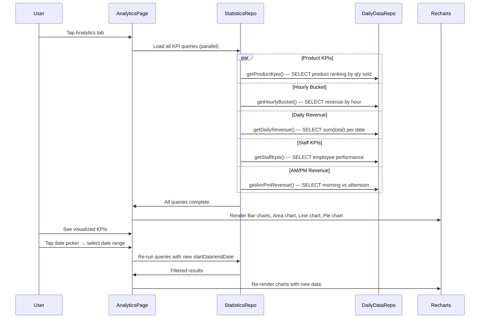

**Key Functions**:

- `src/lib/repositories/statistics-repository.ts` — Aggregation queries
  - `getProductKpis()` — Product sales ranking
  - `getHourlyBucket()` — Revenue by hour
  - `getDailyRevenue()` — Daily revenue trend
  - `getStaffKpis()` — Employee performance
  - `getAmPmRevenue()` — Morning vs afternoon split

**State Transitions**:

1. **Page Load**: Fetch all analytics queries
2. **Charts Render**: Display KPIs via Recharts
3. **Date Filter**: User selects date range
4. **Re-Query**: Fetch filtered data
5. **Re-Render**: Charts update with new data

**Note**: Analytics is **point-in-time** (no real-time updates). Refresh page to see new orders.

**File:Line Citations**:

- `src/pages/analytics/analytics-page.tsx` — UI
- `src/lib/repositories/statistics-repository.ts` — Queries
- `src/components/charts/` — Chart components

---

## Flow 8: Manual Backup

**Entry Point**: Settings → Cloud Backup → "Backup Now"

**Duration**: 20–60 seconds

**Sequence**:

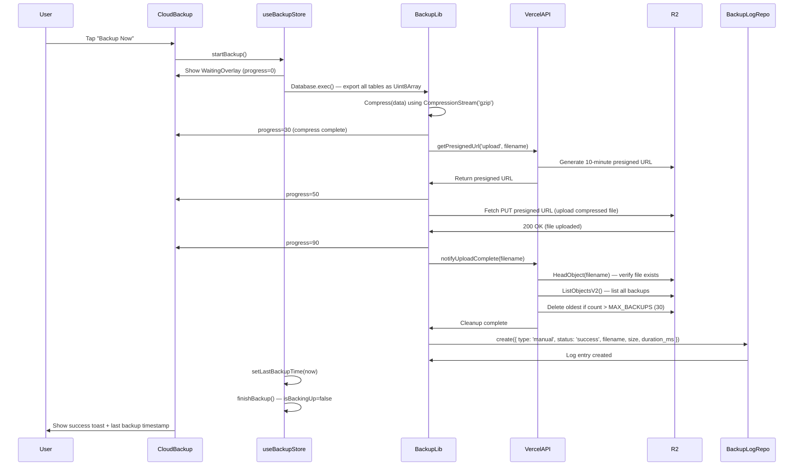

**Key Functions**:

- `src/lib/backup.ts:compress()` — Gzip compress database
- `src/lib/backup.ts:upload()` — Upload via presigned URL
- `src/lib/backup.ts:notifyUploadComplete()` — POST to /api/backup/complete
- `api/backup/presign.ts` — Generate presigned URL
- `api/backup/complete.ts` — Verify + cleanup old backups
- `src/lib/repositories/backup-log-repository.ts:create()` — Log backup

**Business Rules Enforced**:

- Rule 3: Backup retention (max 30 per device)
- Rule 13: Gzip compression (60–80% bandwidth savings)

**State Transitions**:

1. **Start**: isBackingUp=true, progress=0
2. **Compress**: progress=30
3. **Get Presigned URL**: progress=50
4. **Upload**: progress=90
5. **Verify & Cleanup**: Oldest files deleted if >30
6. **Complete**: isBackingUp=false, lastBackupTime updated, success shown

**File:Line Citations**:

- `src/components/settings/cloud-backup.tsx` — UI
- `src/lib/backup.ts` — Compression & upload logic
- `api/backup/presign.ts` — Presigned URL generation
- `api/backup/complete.ts` — Verification & cleanup
- `src/stores/backup-store.ts` — Progress tracking

**Testing**:

- ✓ Backup completes successfully
- ✓ Cleanup removes oldest files when count > 30
- ✓ File size and duration logged
- ✓ Error handling if upload fails

---

## Flow 9: Automatic Backup (On App Startup)

**Entry Point**: useAutoBackup hook (fires on RootLayout mount)

**Duration**: 0–60 seconds (depends on schedule)

**Sequence**:

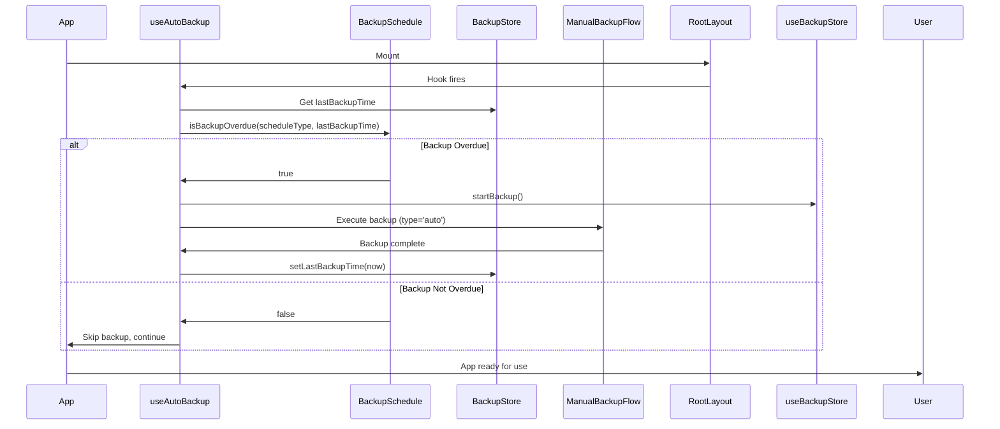

**Key Functions**:

- `src/hooks/use-auto-backup.ts` — Hook logic
- `src/lib/backup-schedule.ts:isBackupOverdue()` — Schedule check
- `src/lib/backup.ts` — Backup execution (type='auto')

**Business Rules Enforced**:

- Rule 2: Taiwan timezone-aware schedule
- Rule 3: Backup retention (max 30)

**Schedule Types**:

- `'none'`: Never backup
- `'daily'`: Backup if none since today (Taiwan time)
- `'weekly'`: Backup if none since Monday (Taiwan time)

**State Transitions**:

1. **App Start**: useAutoBackup hook runs
2. **Check Schedule**: isBackupOverdue() called
3. **If Overdue**: Execute full backup flow (Flow 8) silently
4. **If Not Overdue**: Skip, continue with app
5. **On Complete**: lastBackupTime updated

**Note**: Auto-backup runs **once per app start**. If user reopens app same day, backup not re-run (lastBackupTime already updated).

**File:Line Citations**:

- `src/hooks/use-auto-backup.ts` — Full hook
- `src/lib/backup-schedule.ts` — Schedule logic

---

## Flow 10: Cloud Restore

**Entry Point**: Settings → Cloud Backup → "Restore from Cloud"

**Duration**: 20–60 seconds

**Sequence**:

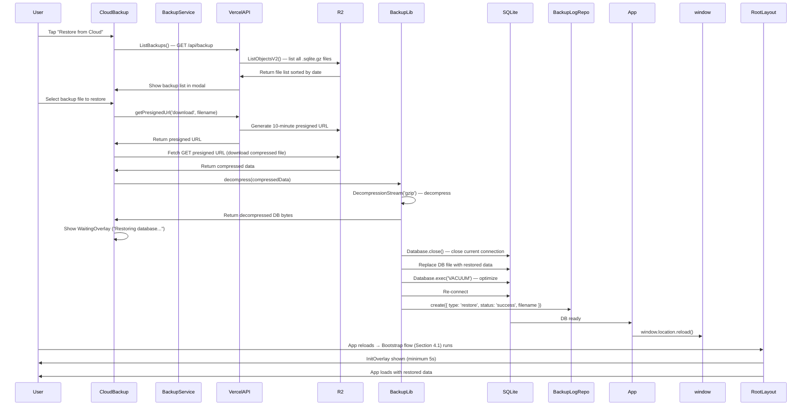

**Key Functions**:

- `api/backup/index.ts` — GET /api/backup (list backups)
- `api/backup/presign.ts` — GET presigned URL
- `src/lib/backup.ts:decompress()` — Decompress gzip
- `src/lib/backup.ts:restoreDatabase()` — Replace DB

**State Transitions**:

1. **List Available**: Fetch all backups from R2
2. **User Selects**: Choose which backup to restore
3. **Download**: Presigned URL download from R2
4. **Decompress**: Gzip decompression
5. **Close DB**: Current SQLite connection closed
6. **Replace**: DB file replaced with restored data
7. **Reload**: App reloads and Bootstrap runs
8. **Complete**: App content rendered with restored data

**File:Line Citations**:

- `src/components/settings/cloud-backup.tsx` — UI
- `api/backup/index.ts` — List endpoint
- `api/backup/presign.ts` — Presigned URL
- `src/lib/backup.ts:decompress()`, `restoreDatabase()`

**Testing**:

- ✓ Restore downloads and decompresses correctly
- ✓ DB replaced successfully
- ✓ App reloads with restored data
- ✓ Error if restore file corrupted

---

## Flow 11: V1→V2 Legacy Data Import

**Entry Point**: First app launch (if V1 backup data exists in localStorage)

**Duration**: 30–120 seconds (depends on data volume)

**Sequence**:

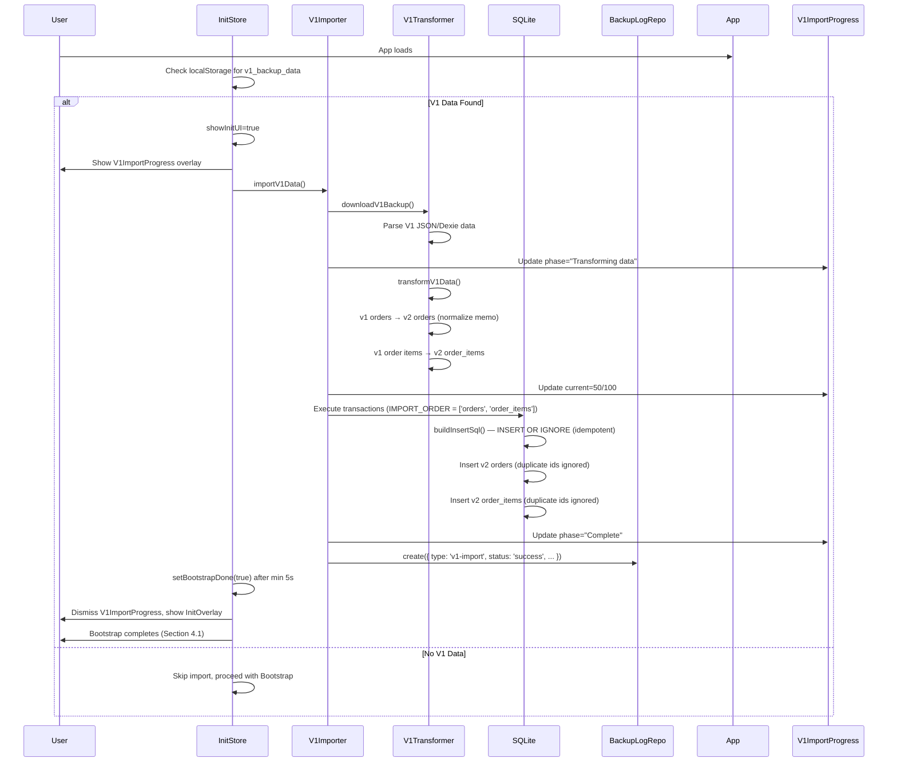

**Key Functions**:

- `src/lib/v1-data-importer.ts` — Import orchestration
- `src/lib/v1-data-transformer.ts` — Data transformation
- `src/lib/v1-data-importer.ts:buildInsertSql()` — INSERT OR IGNORE SQL
- `src/stores/init-store.ts` — V1ImportProgress tracking

**Business Rules Enforced**:

- Rule 5: V1→V2 idempotency (INSERT OR IGNORE, safe re-import)

**State Transitions**:

1. **Check V1 Data**: App detects if legacy data exists
2. **If Found**: Show V1ImportProgress overlay
3. **Download**: Fetch V1 backup (localStorage or user upload)
4. **Transform**: Convert Dexie format to V2 schema
5. **Import**: Batch INSERT OR IGNORE (idempotent)
6. **Log**: Create backup_logs entry with type='v1-import'
7. **Complete**: Bootstrap continues, app ready

**File:Line Citations**:

- `src/lib/v1-data-importer.ts` — Full importer
- `src/lib/v1-data-transformer.ts` — Schema transformation
- `src/stores/init-store.ts` — Progress UI

**Testing**:

- ✓ V1 data correctly transformed
- ✓ INSERT OR IGNORE prevents duplicates on re-import
- ✓ Progress overlay shows phases
- ✓ Errors show user-friendly message

---

## Flow 12: Staff Management (Add/Edit/Soft-Delete)

**Entry Point**: Settings → Staff Admin

**Duration**: 20–30 seconds per operation

**Sequence**:

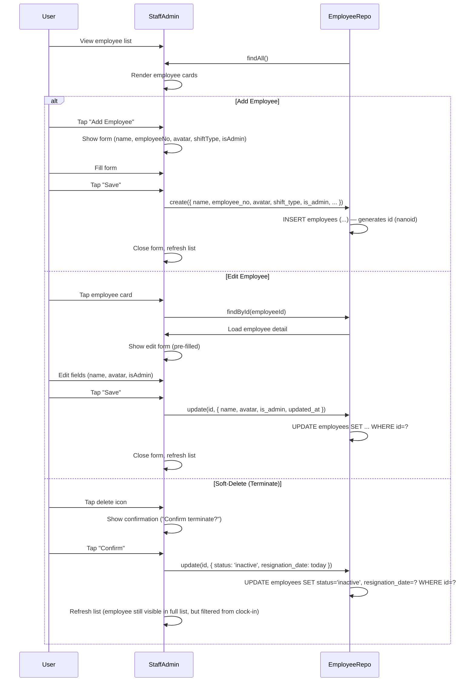

**Key Functions**:

- `src/lib/repositories/employee-repository.ts:create()` — Add employee
- `src/lib/repositories/employee-repository.ts:update()` — Edit or terminate
- `src/lib/repositories/employee-repository.ts:findAll()` — List all employees

**Business Rules Enforced**:

- Rule 6: Employee soft-delete (status='inactive', not hard delete)

**State Transitions**:

1. **Load List**: Fetch all employees
2. **Select Action**: Add, edit, or delete
3. **Form Input**: User fills form
4. **Save**: DB update (INSERT or UPDATE)
5. **List Refresh**: Display updated employee

**File:Line Citations**:

- `src/pages/settings/staff-admin.tsx` — UI
- `src/lib/repositories/employee-repository.ts` — Persistence

**Testing**:

- ✓ Add creates new employee with unique employee_no
- ✓ Edit updates fields
- ✓ Terminate sets status='inactive'
- ✓ Terminated employees hidden from clock-in

---

## Flow 13: Google OAuth Binding

**Entry Point**: Staff Admin → Employee detail → "Link Google"

**Duration**: 10–20 seconds

**Sequence**:

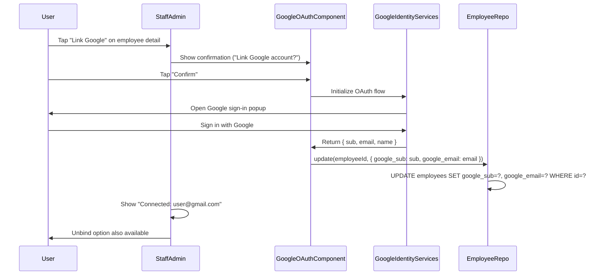

**Key Functions**:

- `src/components/settings/google-oauth.tsx` — OAuth component
- `src/lib/repositories/employee-repository.ts:update()` — Bind employee

**State Transitions**:

1. **Tap Link**: Show confirmation
2. **OAuth Flow**: User signs in with Google
3. **Return Credentials**: google_sub + google_email received
4. **Store**: DB updated with OAuth identifiers
5. **Display**: "Connected: email" shown

**Future Use**: Multi-device account linking (employee logs in on Device B, recognizes account from Device A)

**File:Line Citations**:

- `src/components/settings/google-oauth.tsx` — OAuth logic

---

## Flow 14: Error Handling & Recovery

**Entry Point**: Any unhandled exception

**Duration**: Variable (user-initiated recovery)

**Sequence**:

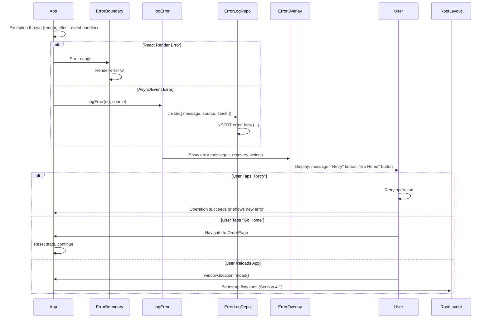

**Key Functions**:

- `src/lib/error-logger.ts:logError()` — Log error
- `src/lib/repositories/error-log-repository.ts:create()` — Persist
- `src/components/error-ui/error-overlay.tsx` — Display error

**Error Types**:

- **Critical** (e.g., DB init failed): InitOverlay shows error state, blocks app
- **Soft** (e.g., network timeout): ErrorOverlay shows message, user can dismiss and continue
- **React Render**: ErrorBoundary catches, prevents white-screen

**State Transitions**:

1. **Error Occurs**: Exception thrown
2. **Logged**: Error persisted to error_logs
3. **Displayed**: ErrorOverlay or error boundary shown
4. **User Recovers**: Retry, go home, or reload

**File:Line Citations**:

- `src/lib/error-logger.ts` — Logging
- `src/components/error-ui/` — UI
- `src/lib/repositories/error-log-repository.ts` — Persistence

---

## Flow 15: PWA Update Detection & Installation

**Entry Point**: Service Worker detects new app version

**Duration**: 5–10 seconds (reload)

**Sequence**:

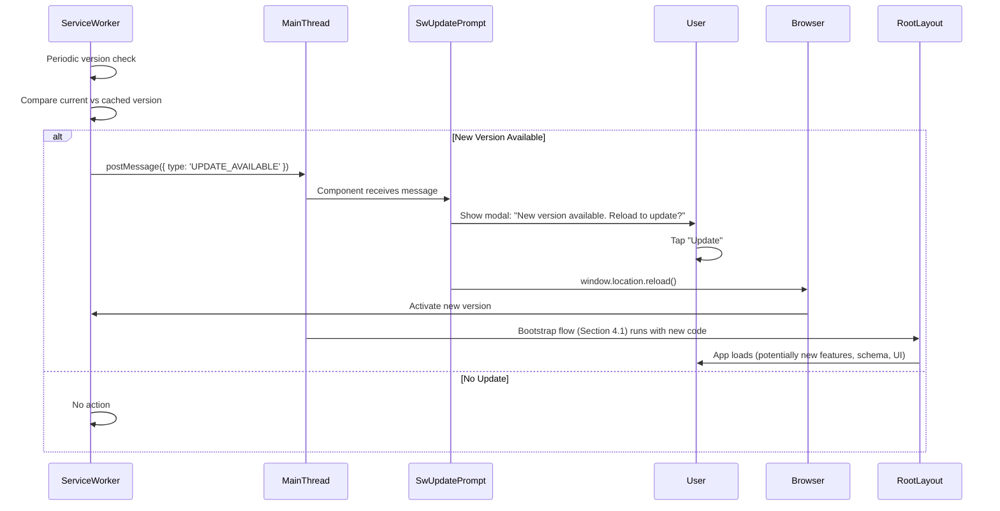

**Key Functions**:

- `src/service-worker/sw.ts` — Service Worker version check + message
- `src/components/sw-update-prompt.tsx` — Update notification UI

**State Transitions**:

1. **Check Version**: Service Worker detects new code
2. **Notify User**: Modal shown asking to reload
3. **User Confirms**: window.location.reload()
4. **New Version Activates**: Service Worker activates new code
5. **Bootstrap Re-Runs**: App initializes with potentially new schema/features

**File:Line Citations**:

- `src/service-worker/sw.ts` — Worker logic
- `src/components/sw-update-prompt.tsx` — Notification UI

---

## Open Questions & Future Flows

1. **Order Type Differentiation** — Currently proto; future: tag orders as delivery/dine-in/pickup
2. **Multi-Device Synchronization** — Currently no active sync; future: R2-based watch hub
3. **Real-Time Analytics** — Currently point-in-time; future: WebSocket for live KPI updates
4. **Inventory Management** — No stock tracking; future: low-stock alerts and reservations
5. **Formal Audit Trail** — No order_edit_logs; future: before/after snapshots for compliance
6. **Receipt Printing** — Order number assigned; future: POS printer integration

---

## Summary

These 15 flows cover all major user interactions and system operations in Tianwen V2. Order-related flows (entry, edit, serve) form the core business. Employee flows (clock-in, staff management) handle HR. Backup flows ensure data resilience. Analytics provides operational insights. Error handling ensures reliability. PWA update keeps app current. Each flow is detailed with sequences, key functions, business rules enforced, and file:line citations for code navigation.

---

**Next Steps:**

- For entity relationships affected by flows, see [02-entities.md](02-entities.md)
- For business rules enforced by flows, see [03-business-rules.md](03-business-rules.md)
- For external integrations used by flows, see [05-integrations.md](05-integrations.md)
