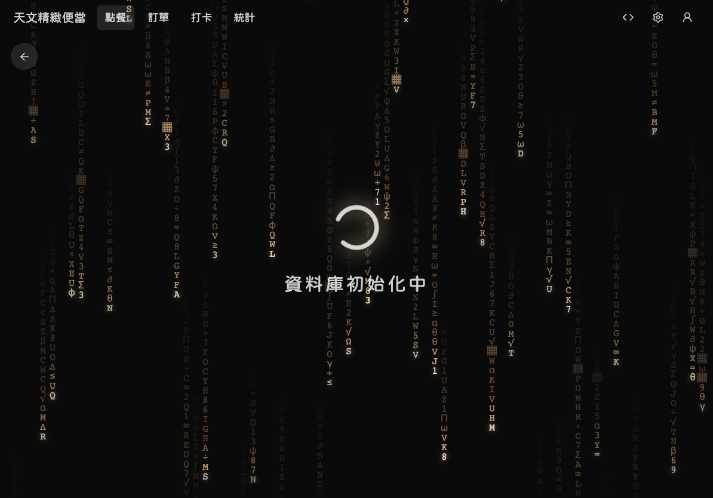
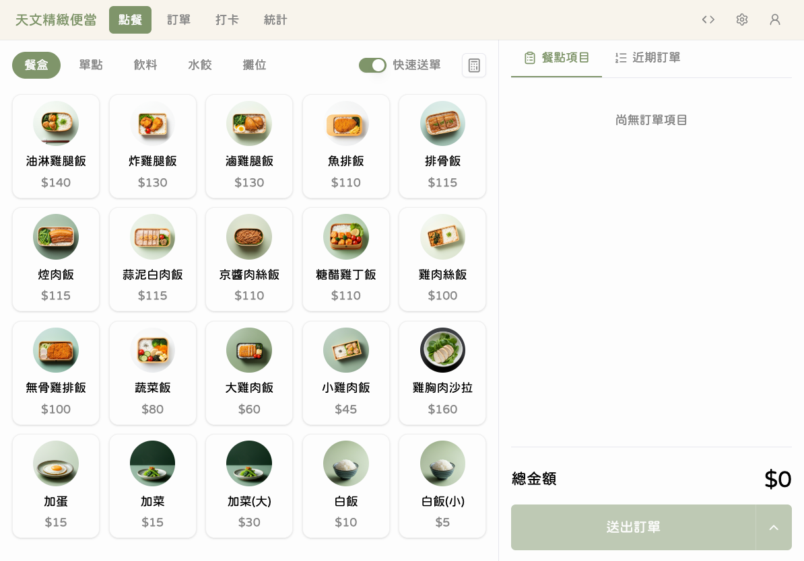
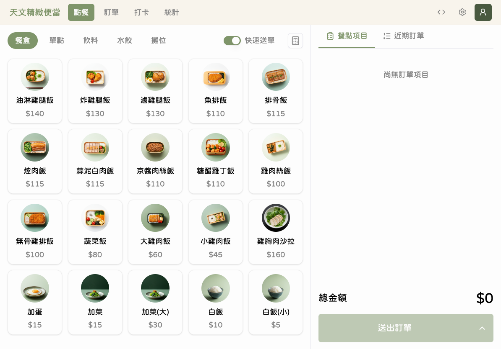
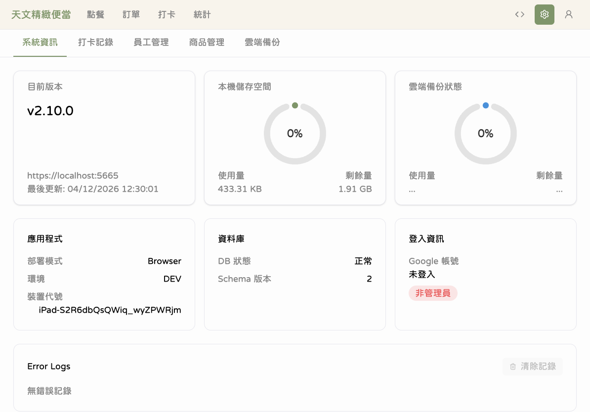
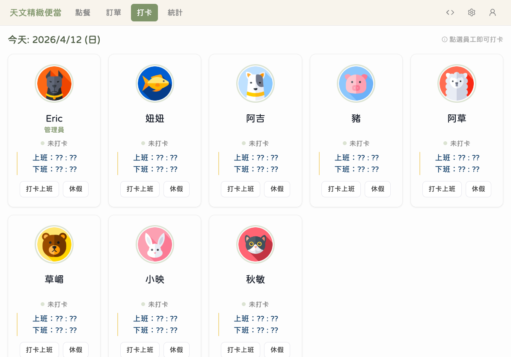

# 首次設定

本章節將帶您完成天文 V2 POS 的安裝與初次設定，認識應用程式的主要介面。

---

## 安裝 PWA 到 iPad 主畫面

天文 V2 是一個 PWA（Progressive Web App），可以像一般 App 一樣安裝在 iPad 主畫面上。

### 步驟 1：開啟 Safari 瀏覽器

在 iPad 上打開 Safari，輸入天文 V2 的網址。

### 步驟 2：點擊分享按鈕

點擊 Safari 底部工具列的「分享」圖示（方框加上箭頭的圖示）。

### 步驟 3：選擇「加入主畫面」

在彈出的選單中，向下滑動找到「加入主畫面」，點擊後確認名稱，再點「新增」。

完成後，iPad 主畫面上會出現天文便當的圖示，以後直接點擊即可開啟。

---

## 第一次啟動

### 步驟 1：等待系統初始化

第一次開啟應用程式時，系統會進行資料庫初始化。畫面上會出現初始化動畫，請耐心等待約 3-5 秒。

系統正在建立本機資料庫，這個過程只有第一次使用時會出現。

### 步驟 2：進入主畫面

初始化完成後，會自動進入點餐頁面。左側是商品列表區，右側是訂單面板。

這就是您每天最常使用的點餐介面。

---

## 認識導覽列

畫面頂部的導覽列是切換各功能模組的入口。

導覽列包含以下功能分頁：

| 分頁 | 功能           | 說明                       |
| ---- | -------------- | -------------------------- |
| 點餐 | 日常點餐下單   | 預設首頁，選商品送出訂單   |
| 打卡 | 員工上下班打卡 | 每天上班、下班時使用       |
| 訂單 | 查看歷史訂單   | 依日期瀏覽所有訂單         |
| 統計 | 營收與績效分析 | 查看銷售數據和圖表         |
| 設定 | 系統管理功能   | 員工管理、商品管理、備份等 |

---

## 右上角選單

點擊右上角的使用者圖示，可以看到更多選項。

管理員可以在此處使用 Google 帳號登入，解鎖員工管理、商品管理、雲端備份等進階功能。

---

## 設定頁面

進入設定頁面後，可以看到五個分頁標籤。

| 分頁     | 說明                     | 需要權限     |
| -------- | ------------------------ | ------------ |
| 系統資訊 | 查看應用版本、資料庫狀態 | 不需要       |
| 打卡記錄 | 查看出勤歷史             | 不需要       |
| 員工管理 | 新增、編輯、停用員工     | 需管理員登入 |
| 商品管理 | 編輯商品價格、上下架     | 需管理員登入 |
| 雲端備份 | 備份還原、排程設定       | 需管理員登入 |

標示鎖頭圖示的分頁需要管理員權限才能操作。

---

## 打卡頁面概覽

切換到「打卡」分頁，可以看到所有員工的卡片。

每張卡片顯示員工的名字和目前出勤狀態。預設的員工名單包含：Eric、妞妞、阿吉、豬、阿草、草嵋、小映、秋敏。

---

## 💡 小提醒

- 安裝到主畫面後，開啟速度會比從 Safari 打開更快
- 第一次初始化後，之後開啟都不會再出現等待畫面（除非重新安裝）
- 應用程式只支援直式（直向）模式，如果把 iPad 轉成橫的會出現提醒
- 如果開啟後畫面一片空白，請檢查網路連線後重新整理

## ⚠️ 常見問題

**Q：安裝後在主畫面找不到圖示？**
A：請確認在 Safari 的分享選單中選擇的是「加入主畫面」而非「加入書籤」。

**Q：初始化畫面停留超過 30 秒？**
A：請關閉應用程式後重新開啟。如果問題持續，請參考[疑難排解](90-疑難排解.md#載入畫面停留過久)。

**Q：畫面顯示「請將裝置轉為直向」？**
A：請將 iPad 轉為直式（Home 鍵在下方）使用，本應用不支援橫向操作。
