# 點餐操作

本章節說明從選擇商品到送出訂單的完整流程，以及如何修改已送出的訂單。

---

## 瀏覽商品與分類

### 步驟 1：認識點餐頁面

點餐頁面分為左右兩個區域：左側（約 65%）是商品列表，右側（約 35%）是訂單面板。

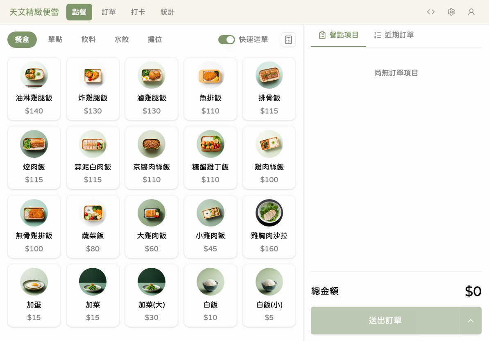

商品列表上方有分類標籤，可以快速切換不同類別的商品。

### 步驟 2：切換商品分類

**點擊**上方的分類標籤，切換顯示不同類別的商品。

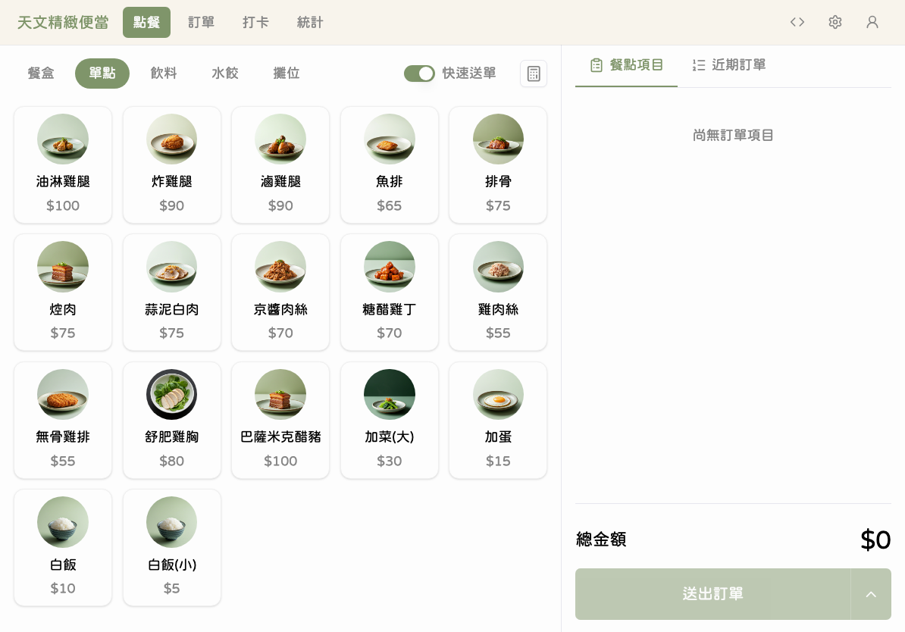

系統提供五大分類：

| 分類 | 說明         | 標示顏色 |
| ---- | ------------ | -------- |
| 攤位 | 攤位現做品項 | 深藍色   |
| 餐盒 | 各式便當餐盒 | 綠色     |
| 單點 | 單點小菜配料 | 金棕色   |
| 飲料 | 各式冷熱飲品 | 藍色     |
| 水餃 | 各種水餃品項 | 紫色     |

---

## 加入品項到訂單

### 步驟 3：選擇商品

**點擊**左側商品列表中想要加入的品項按鈕。

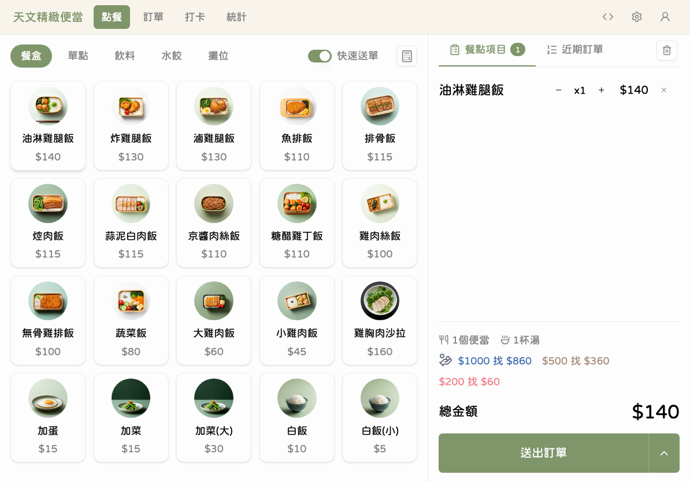

品項會自動以數量 1 加入右側的訂單面板。

### 步驟 4：調整數量

如果需要多份，可以在訂單面板中使用 +/- 按鈕調整數量。

將數量減為 0 即可移除該品項。

---

## 多品項購物車

### 步驟 5：檢視購物車

持續點選商品，所有品項會依序列在訂單面板中，並即時計算小計與總金額。

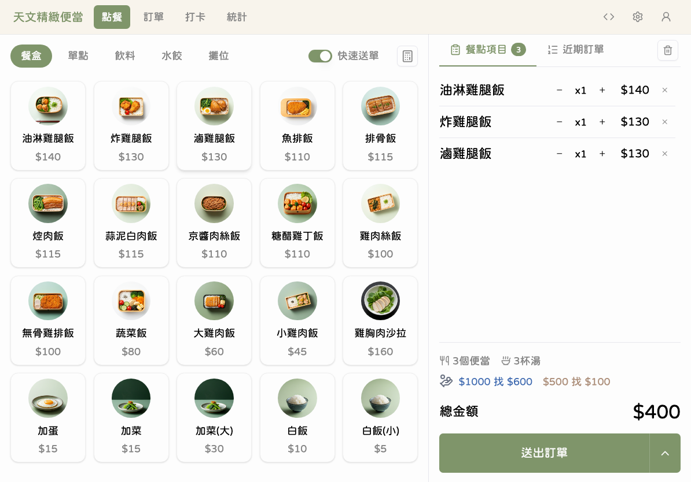

訂單面板會顯示每個品項的名稱、數量和金額，底部顯示總計。

---

## 品項備註

### 步驟 6：為品項加上備註

如果客人有特殊要求，可以為品項加上備註標籤。

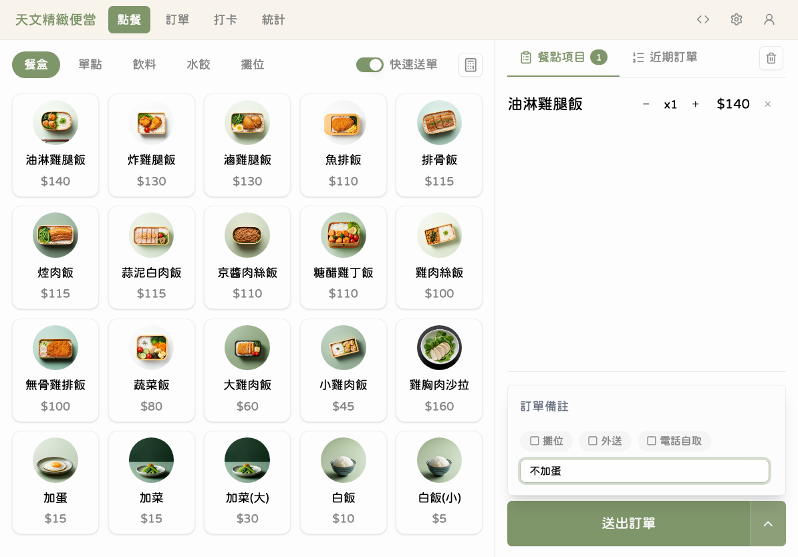

可以選擇預設的備註標籤，或手動輸入自訂備註。含有「攤位」分類品項的訂單會自動加上「攤位」備註標記。

---

## 使用計算機（自訂品項或折扣）

### 步驟 7：開啟計算機

需要輸入自訂金額時，可以使用計算機功能。

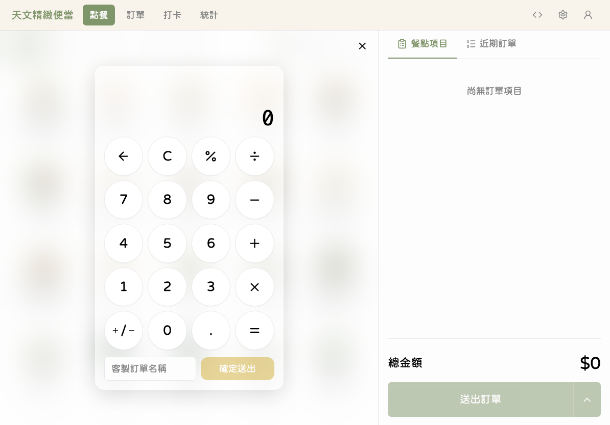

在計算機介面中輸入品項名稱和金額。

### 步驟 8：確認自訂品項

確認輸入的品項和金額無誤後，加入訂單。

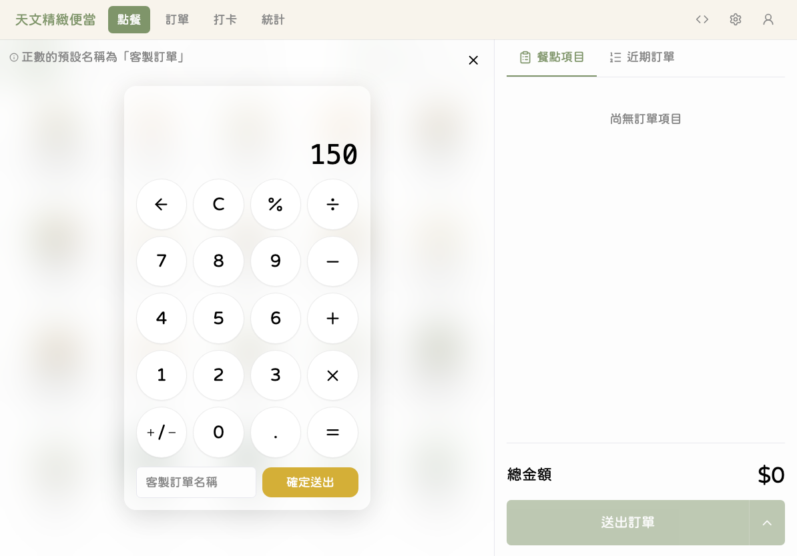

自訂品項會和其他商品一起顯示在訂單面板中。

---

## 折扣處理

### 步驟 9：套用折扣

在訂單面板的折扣區域，可以選擇或輸入折扣。

折扣金額會從總金額中扣除，畫面上會清楚顯示原價、折扣金額和折後總價。

---

## 送出訂單

### 步驟 10：檢視訂單總金額

系統預設使用**快速模式**，點擊「送出訂單」後會直接送出，不會跳出確認視窗。

### 步驟 11：送出訂單 (非快速模式)

確認所有品項和折扣都正確後，檢查畫面底部的總金額。

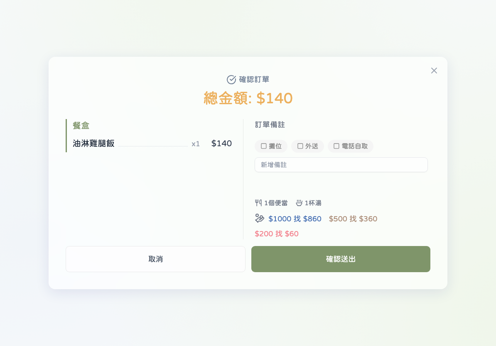

確認無誤後，點擊「送出訂單」按鈕。

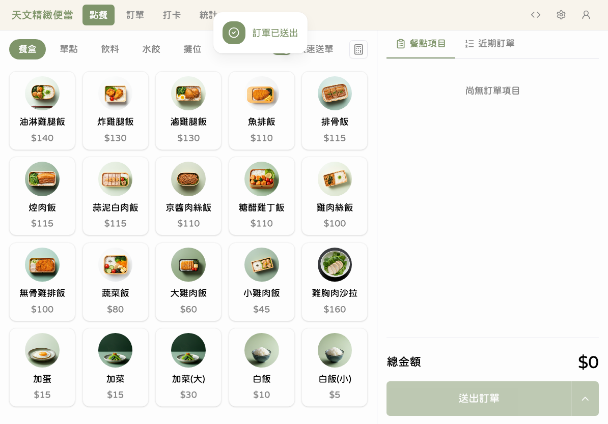

> **快速模式 vs 標準模式**
>
> | 模式             | 行為                                             | 適合                         |
> | ---------------- | ------------------------------------------------ | ---------------------------- |
> | 快速模式（預設） | 點擊送出後直接完成，不跳確認視窗                 | 熟練的操作人員，加快出單速度 |
> | 標準模式         | 點擊送出後先顯示訂單摘要確認視窗，再點確認才送出 | 新手操作人員，避免送錯單     |
>
> 模式切換可在右側訂單面板的設定中調整。

---

## 近期訂單

### 步驟 12：查看近期訂單

訂單送出成功後，可以在右側面板切換到「近期訂單」分頁，查看剛剛送出的訂單。

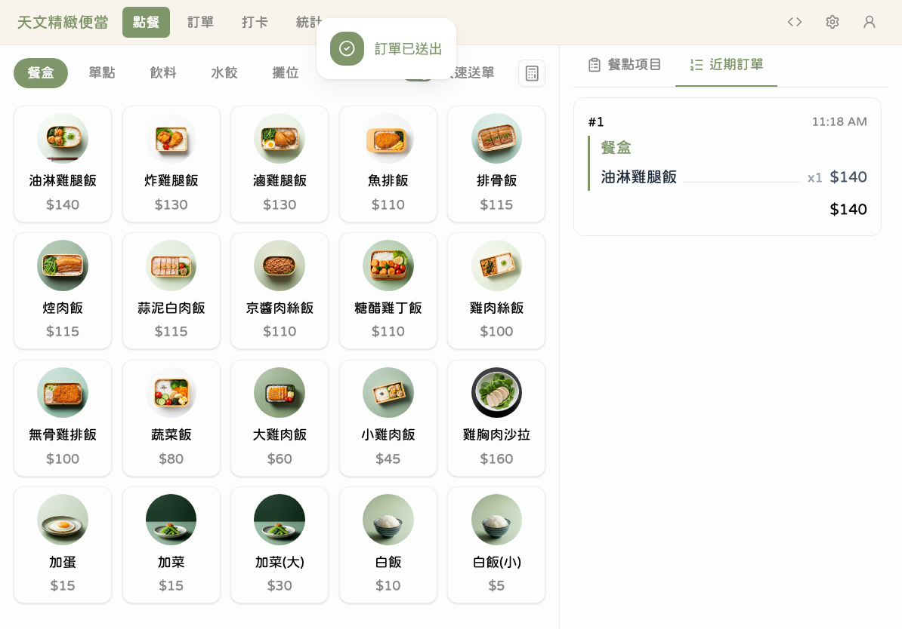

近期訂單列表會顯示今天所有已送出的訂單，包含訂單編號、品項摘要和金額。

---

## 編輯已送出訂單

### 步驟 13：修改訂單

如果發現訂單有誤，在近期訂單列表中可以編輯訂單。

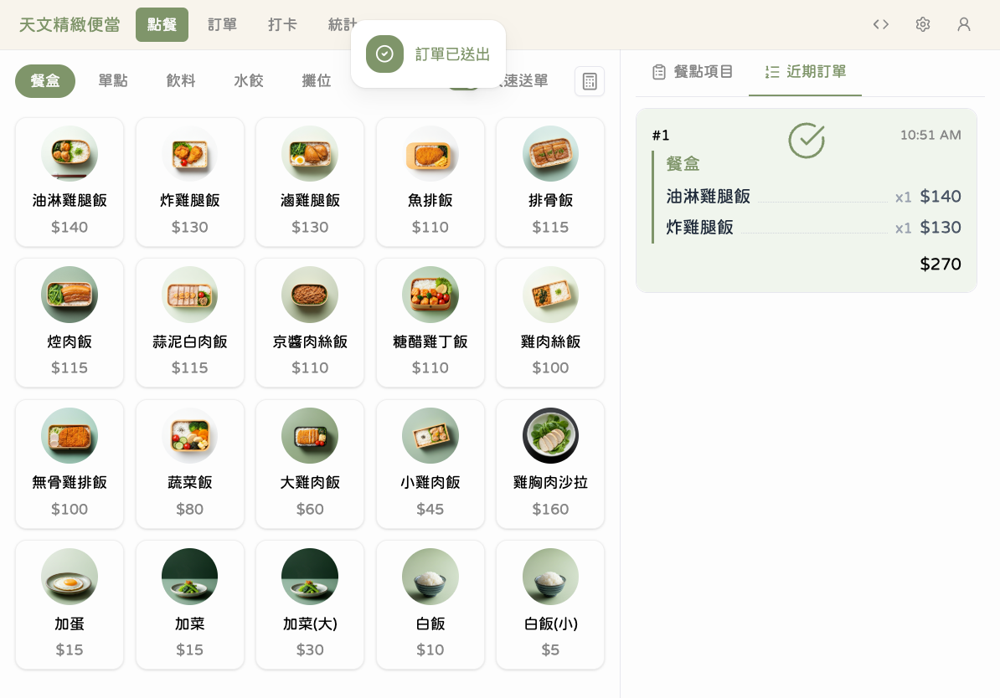

在訂單項目上向左滑動，會出現編輯和刪除的操作按鈕。點擊「編輯」即可修改品項數量或刪除品項。

---

## 送餐完成

### 步驟 14：標記已送餐

當餐點已送達客人手中，可以將訂單標記為「已送餐」。

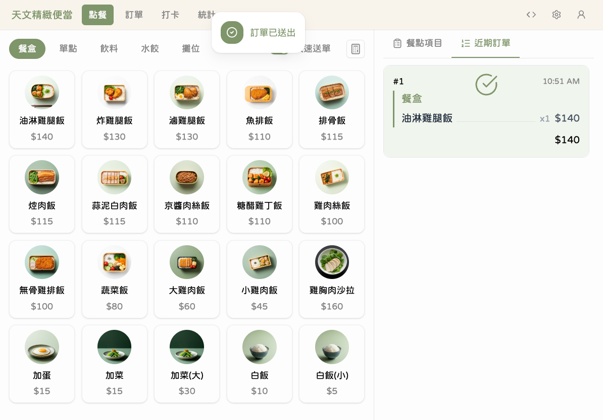

標記後訂單會顯示已送餐的狀態標記，方便追蹤出餐進度。

---

## 如果做錯了

| 狀況     | 處理方式                                                                                                       |
| -------- | -------------------------------------------------------------------------------------------------------------- |
| 送錯訂單 | 在近期訂單中找到該筆訂單，左滑點「編輯」進行修改                                                               |
| 加錯品項 | 在購物車中將該品項數量減為 0，或直接刪除                                                                       |
| 數量不對 | 在購物車中用 +/- 按鈕調整正確數量                                                                              |
| 價格不對 | 已送出的訂單價格無法更改（快照定價機制）。如需修改商品價格，請管理員到「商品管理」調整，但修改後只影響新的訂單 |
| 忘了打折 | 編輯已送出的訂單，重新加入折扣                                                                                 |

---

## 💡 小提醒

- 點選商品後會立即加入購物車，不需要額外確認
- 「攤位」分類的商品加入訂單時，系統會自動在備註加上「攤位」標記
- 每筆訂單的價格在送出時就已固定，之後修改商品售價不會影響已送出的訂單
- 訂單編號是按照當天送出的順序自動編號（1、2、3...）

## ⚠️ 常見問題

**Q：商品列表是空的？**
A：請確認是否選擇了正確的分類標籤。如果所有分類都沒有商品，請聯繫管理員確認商品是否已上架。

**Q：送出訂單後想取消？**
A：目前沒有取消訂單的功能，但可以透過「編輯」移除所有品項。

**Q：折扣按鈕在哪裡？**
A：折扣區域在訂單面板的小計金額下方。向下滑動即可看到。
