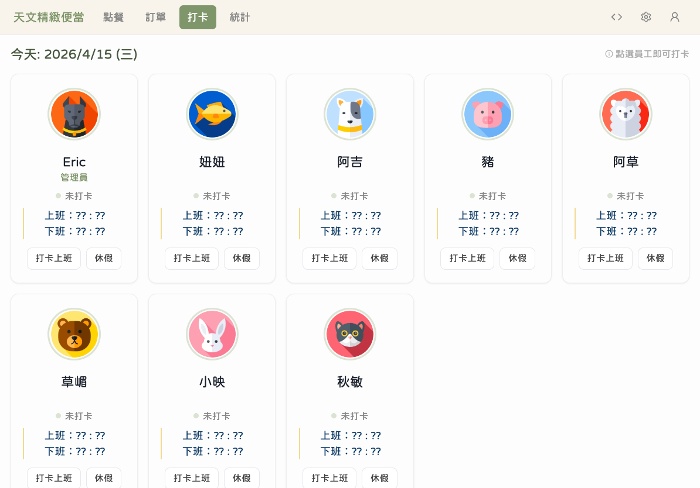
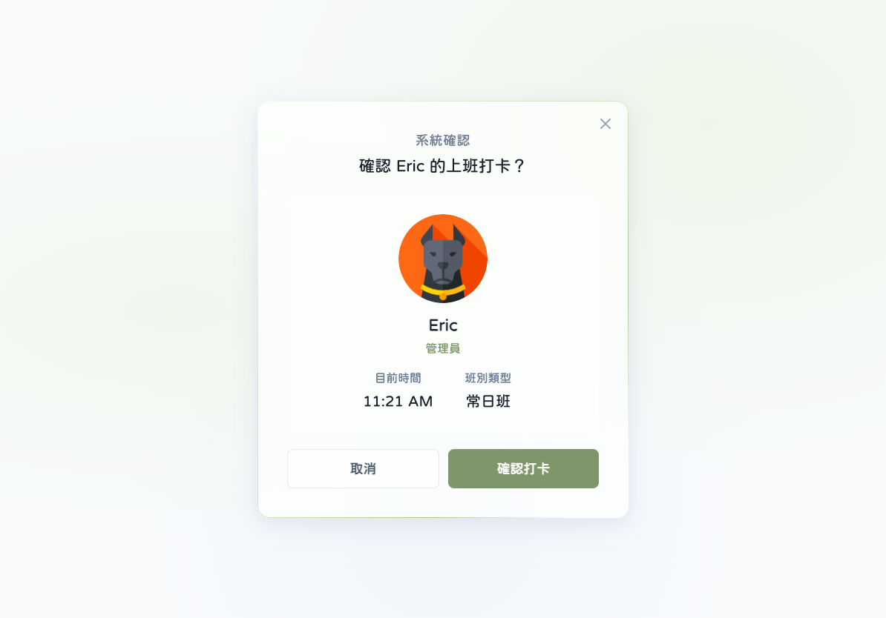
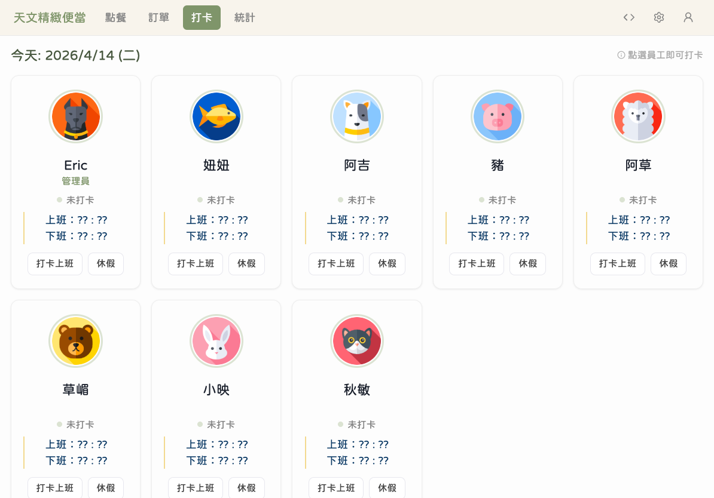
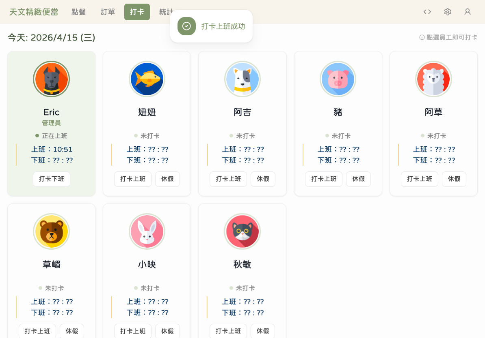
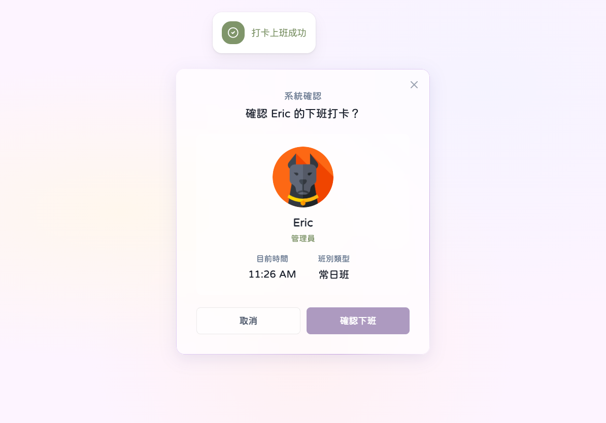
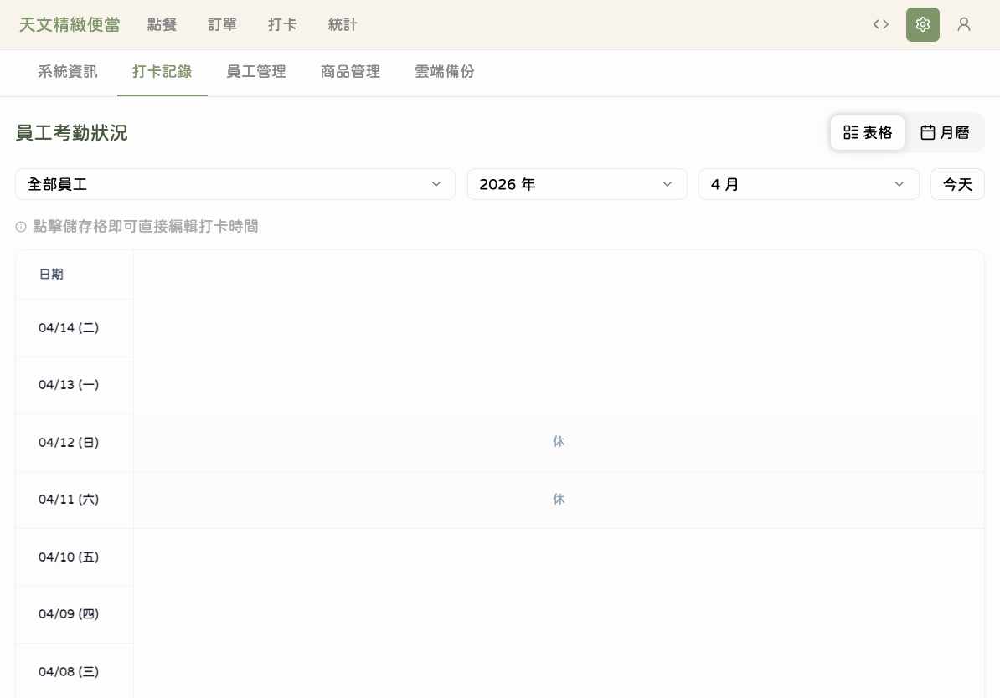
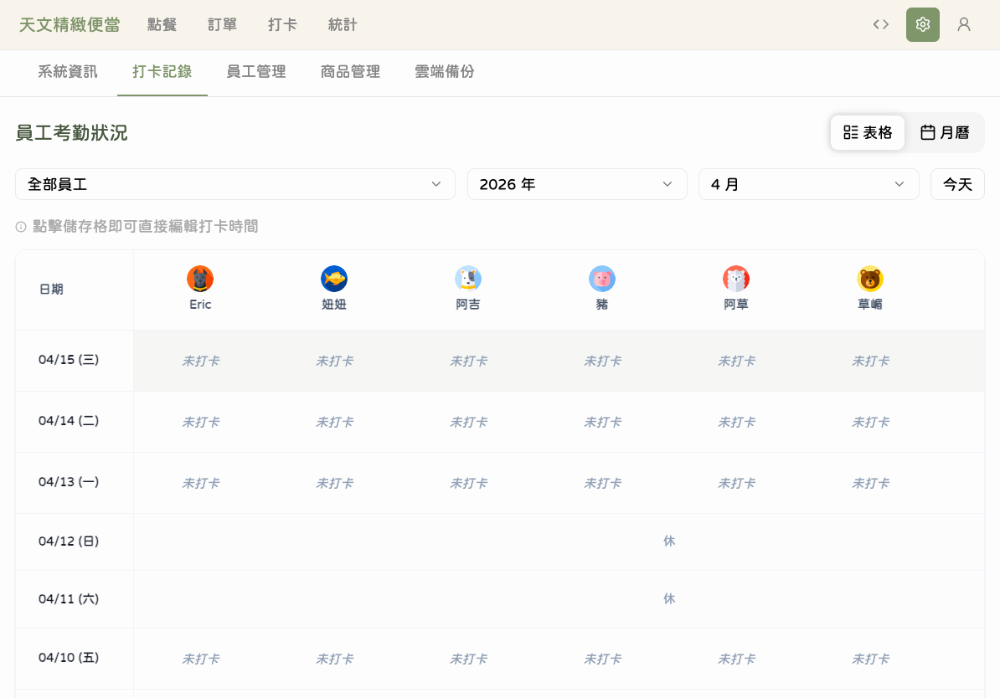

# 打卡與出勤

本章節說明員工如何使用打卡功能記錄上下班時間，以及如何申請休假和查看出勤記錄。

---

## 進入打卡頁面

### 步驟 1：切換到打卡分頁

**點擊**導覽列上的「打卡」分頁，進入打卡頁面。

頁面上會顯示所有員工的卡片，每張卡片上有員工的名字和目前的出勤狀態。

---

## 打卡上班

### 步驟 2：點擊自己的名字

找到自己的員工卡片，**點擊**該卡片。

系統會跳出確認視窗，顯示您的名字和目前時間，並提供「打卡上班」、「休假」和「取消」三個按鈕。

### 步驟 3：確認打卡

**點擊**「打卡上班」按鈕完成打卡。

系統會記錄您的上班時間。

### 步驟 4：確認打卡成功

打卡成功後，您的員工卡片狀態會更新為「正在上班」，並顯示打卡時間。

卡片上的狀態指示會從「未打卡」變成「正在上班」，方便所有人確認。

---

## 打卡下班

### 步驟 5：下班打卡

下班時，再次**點擊**自己的員工卡片。

確認視窗會顯示「打卡下班」按鈕和已上班的時數。**點擊**「打卡下班」完成下班打卡。

系統會自動計算您今天的工作時數。

---

## 申請休假

### 步驟 6：申請休假

如果今天要休假，在打卡確認視窗中**點擊**「休假」按鈕。

系統會記錄當天為休假狀態。如果需要取消休假，再次點擊自己的卡片，選擇「取消休假」即可。

---

## 查看打卡記錄

### 步驟 7：進入打卡記錄

在「設定」分頁中，切換到「打卡記錄」標籤頁，可以查看所有員工的出勤記錄。

頁面會按日期列出打卡記錄，包含上班時間、下班時間和工時。可以使用日期導航按鈕切換不同日期或週期。

### 步驟 8：查看個別員工記錄

**點擊**特定日期的記錄，可以展開查看該員工的詳細出勤資訊。

詳細資訊包含：員工姓名、班別、打卡上班時間、打卡下班時間、總工時。

---

## 💡 小提醒

- 打卡時間是以台灣時區（UTC+8）記錄的
- 每天只需打卡一次上班、一次下班
- 打卡記錄會永久保存，不會因為備份還原而遺失
- 如果需要查看某段期間的出勤統計，可以到「統計」頁面的員工績效分頁

## ⚠️ 常見問題

**Q：忘記打卡上班怎麼辦？**
A：請告知管理員。目前系統沒有補卡功能，但管理員可以在記錄中做備註說明。建議養成到店就打卡的習慣。

**Q：打卡後發現打錯人了？**
A：打卡記錄目前無法刪除或修改，請告知管理員做記錄。

**Q：休假申請送出後可以取消嗎？**
A：可以，再次點擊自己的卡片，選擇「取消休假」即可。

**Q：「缺勤」狀態是什麼意思？**
A：如果當天既沒有打卡也沒有申請休假，系統會自動記錄為「缺勤」狀態。

**Q：打卡記錄在哪裡看？**
A：進入「設定」→「打卡記錄」分頁即可查看。
