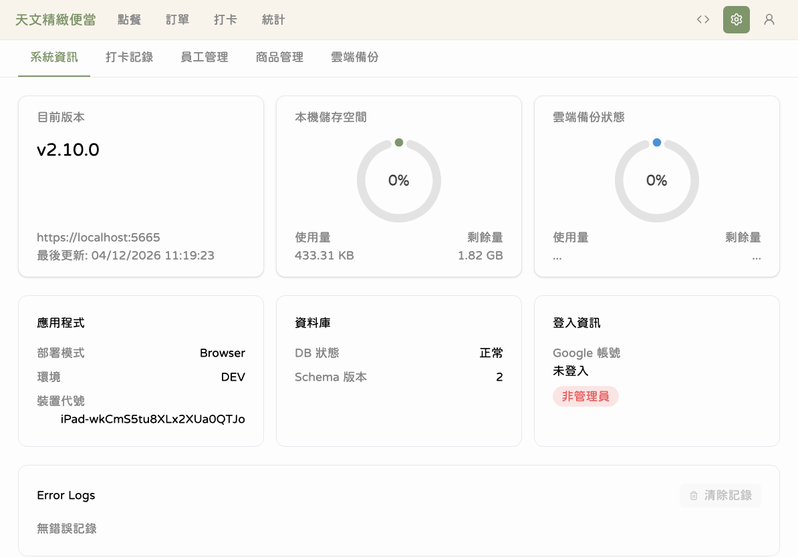
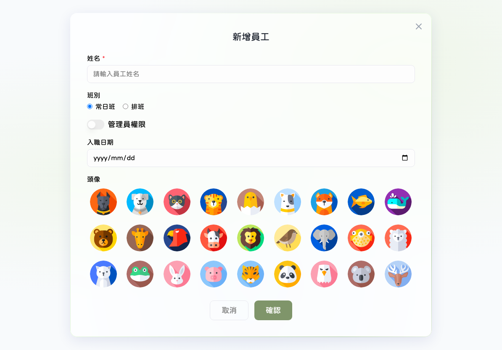
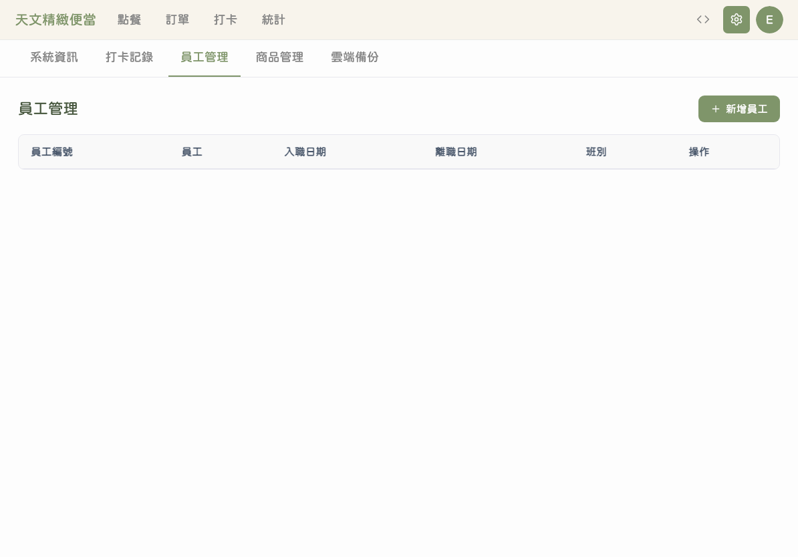
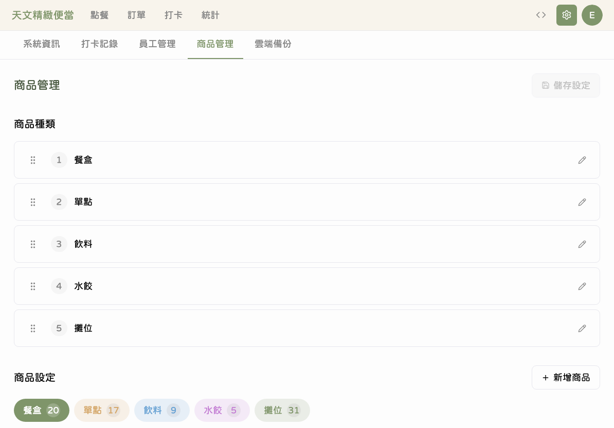
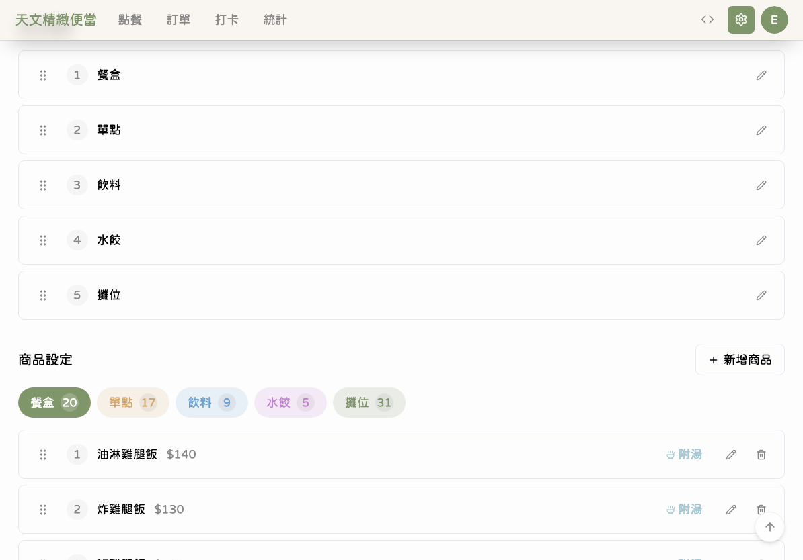
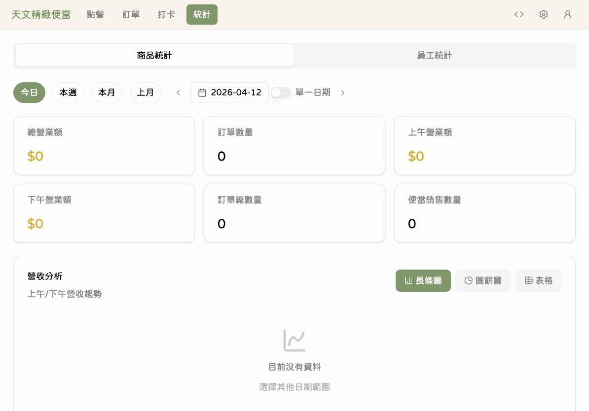
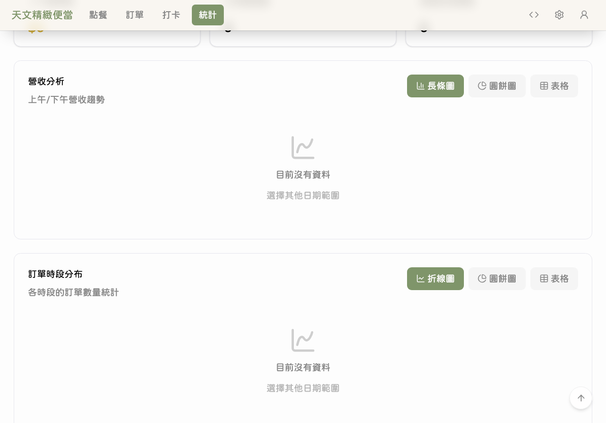

# 管理功能

本章節說明需要管理員權限的進階功能，包含員工管理、商品管理和營收統計。

> 本章節的所有操作都需要先使用 Google 帳號登入。

---

## 管理員登入

要使用員工管理、商品管理或雲端備份功能，需要先以管理員身份登入。

**點擊**導覽列右上角的使用者圖示，選擇「使用 Google 帳號登入」。登入成功後，受保護的分頁上的鎖頭圖示會消失，代表已經可以操作。

---

## 系統資訊

### 步驟 1：查看系統資訊

進入「設定」分頁，預設顯示的就是「系統資訊」頁面。

系統資訊頁面顯示：

| 項目 | 說明 |
|------|------|
| 應用程式版本 | 目前安裝的版本號碼 |
| 資料庫大小 | 本機 SQLite 資料庫的檔案大小 |
| 最後備份時間 | 上次成功備份的時間 |
| 裝置代號 | 此台 iPad 的識別名稱 |

---

## 員工管理

### 步驟 2：查看員工列表

**點擊**「員工管理」分頁標籤，進入員工管理頁面。

頁面顯示所有員工的清單，每位員工會顯示頭像、姓名、員工編號、班別和目前狀態（上班/離職）。

### 步驟 3：新增員工

**點擊**頁面上方的「新增員工」按鈕。

填寫表單中的必要資訊：

- 員工姓名
- 虛擬角色（選擇動物頭像）
- 班別（常日班或排班）
- 入職日期
- 是否為管理員

填寫完成後**點擊**「儲存」。

### 步驟 4：編輯員工資料

在員工列表中，**點擊**要修改的員工旁邊的編輯圖示。

表單會自動帶入該員工的現有資料，修改需要的欄位後**點擊**「儲存」。

### 步驟 5：停用員工

如果員工離職，可以將帳號設為「離職」狀態。

系統使用軟刪除機制，停用後該員工不會出現在打卡頁面，但歷史記錄會保留。如有需要可以重新啟用。

### 步驟 6：連結 Google 帳號

如果需要讓員工以管理員身份登入，**點擊**員工資料中的「連結 Google 帳號」按鈕。

連結後，該員工可以使用自己的 Google 帳號登入管理功能。

---

## 商品管理

### 步驟 7：查看商品列表

**點擊**「商品管理」分頁標籤。

商品按照分類（攤位、餐盒、單點、飲料、水餃）分組顯示。每個商品卡片上有名稱、售價和操作按鈕。

### 步驟 8：編輯商品

**點擊**商品卡片上的編輯圖示，開啟編輯表單。

可以修改商品的名稱和售價。修改完成後**點擊**「儲存」。

### 步驟 9：價格變更記錄

每次修改商品價格，系統都會自動留下記錄。

價格變更記錄包含：商品名稱、修改前價格、修改後價格、修改者和修改時間。

**重要：** 修改商品價格只會影響之後的新訂單。已經送出的訂單金額不會改變，因為系統使用「快照定價」機制 — 訂單送出時的價格就會被鎖定。

---

## 營收統計

### 步驟 10：查看統計總覽

**點擊**導覽列的「統計」分頁，進入營收統計頁面。

統計頁面上方顯示關鍵指標（KPI），包含總營收、日平均營收、上午營收和下午營收。

### 步驟 11：選擇日期範圍

使用日期範圍選擇器，可以查看特定期間的統計資料。

可以選擇「今天」、「本週」、「本月」或自訂日期範圍。

### 步驟 12：圖表分析

頁面下方提供多種圖表，協助您了解銷售趨勢。

主要圖表包含：

| 圖表 | 內容 |
|------|------|
| 營收趨勢 | 按日期顯示每天的營收變化 |
| 商品銷售排名 | 顯示銷售數量前幾名的商品 |
| 分類銷售分布 | 各分類的營收佔比 |
| 員工績效 | 每位員工的訂單數和接單金額 |

---

## 💡 小提醒

- 管理員登入狀態會保持一段時間，不需要每次都重新登入
- 員工停用後可以隨時重新啟用，不需要重新建立
- 商品改價前，建議先確認是否有未完成的訂單
- 統計頁面的數據是即時計算的，新送出的訂單馬上就會反映在統計中
- 時段營收（上午/下午）的分界點是中午 12 點

## ⚠️ 常見問題

**Q：忘記管理員密碼？**
A：管理員使用 Google 帳號登入，不需要記密碼。如果 Google 帳號有問題，請洽 Google 帳號支援。

**Q：可以刪除商品嗎？**
A：商品無法直接刪除，以確保歷史訂單中的資料完整保留。如需調整商品，請修改商品名稱或售價。

**Q：統計數據和實際金額不一致？**
A：請確認日期範圍是否正確，以及是否有編輯過訂單。如果問題持續，請嘗試重新整理頁面。

**Q：商品改價後舊訂單也跟著變了？**
A：不會。天文 V2 使用快照定價機制，每筆訂單在送出時就鎖定了當時的價格，之後的價格修改不會影響已送出的訂單。
