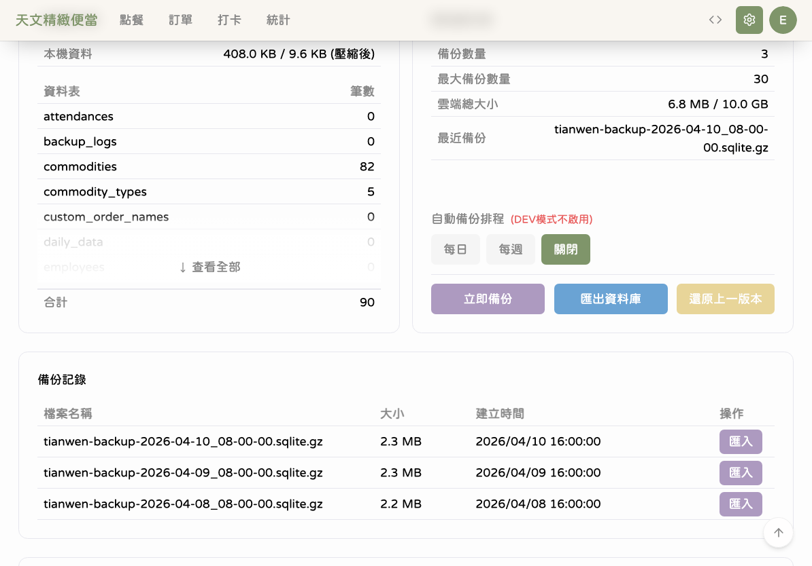
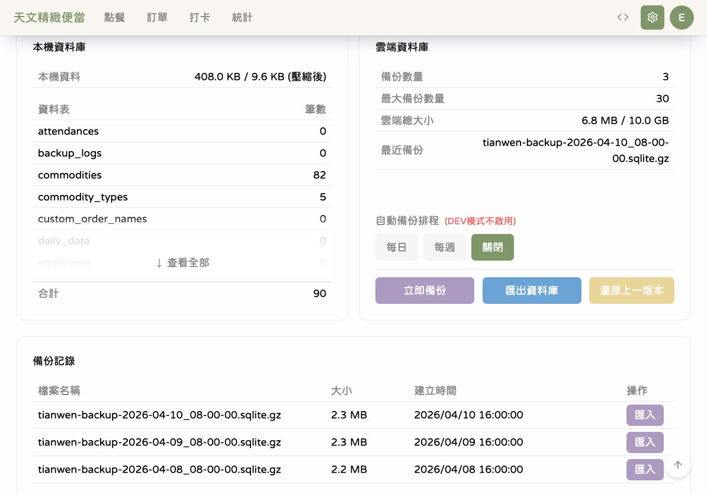
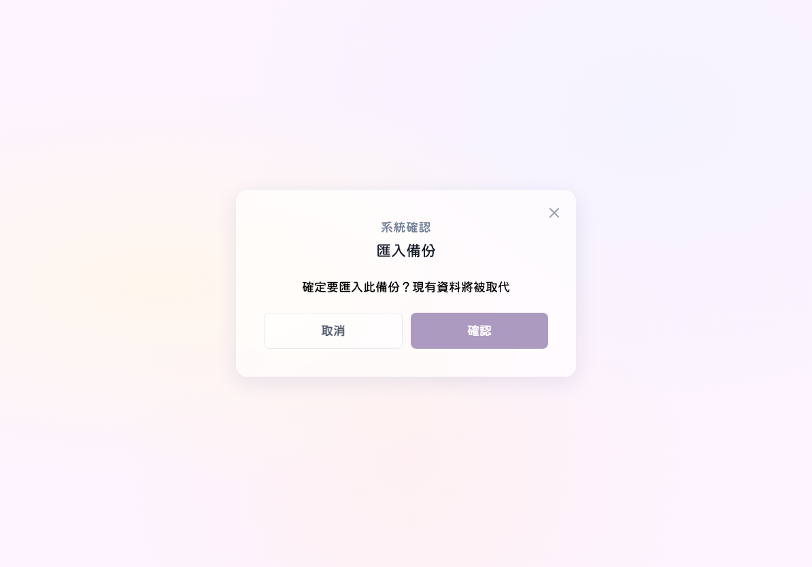
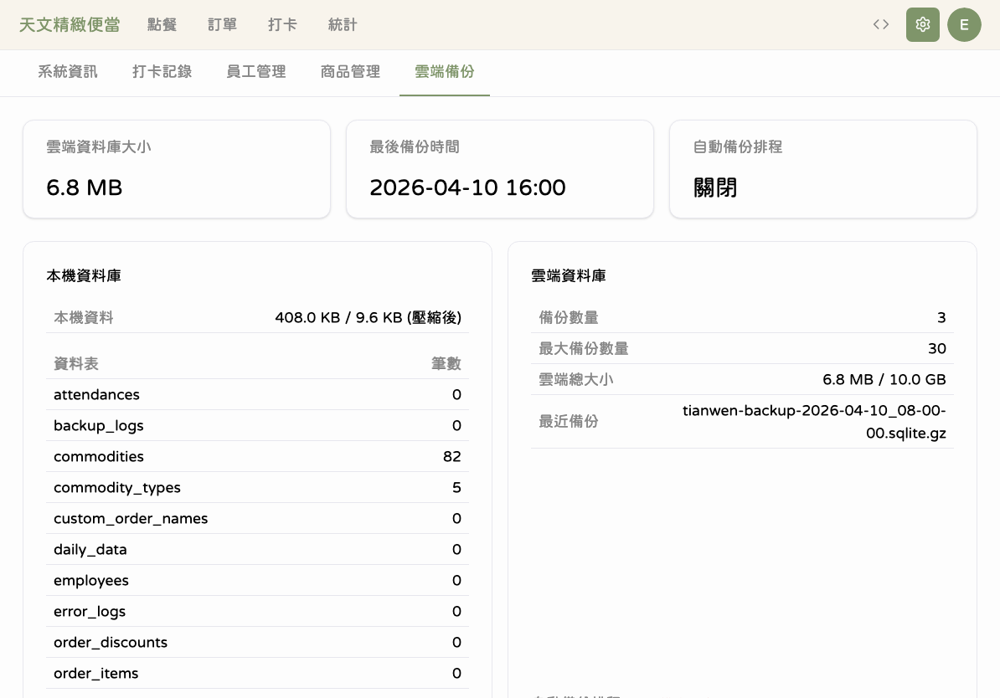
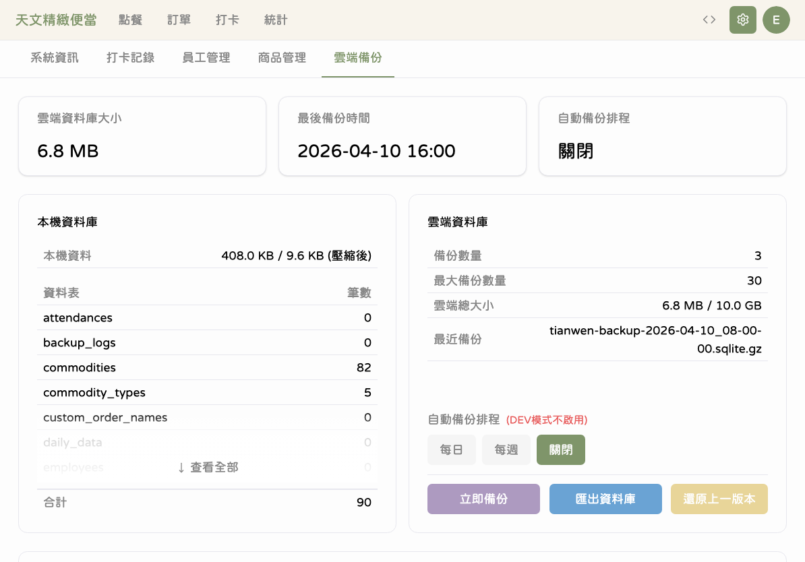
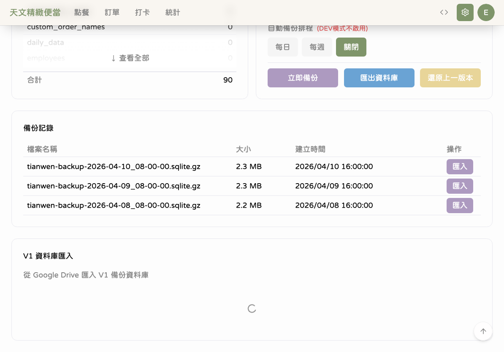

# 雲端備份

本章節說明如何使用雲端備份功能保護您的資料，包含自動備份排程、手動備份、還原和 V1 資料匯入。

> 本章節的所有操作都需要先使用 Google 帳號登入管理員身份。

---

## 雲端備份概覽

### 步驟 1：進入雲端備份頁面

進入「設定」→「雲端備份」分頁，查看目前的備份狀態。

概覽面板顯示以下重要資訊：

| 項目         | 說明                     |
| ------------ | ------------------------ |
| 最後備份時間 | 上次成功備份的日期和時間 |
| 雲端資料大小 | 備份檔案在雲端佔用的空間 |
| 備份狀態     | 上次備份是否成功         |
| 下次自動備份 | 預計的下一次自動備份時間 |

---

## 備份排程設定

### 步驟 2：設定自動備份

在備份設定區域，可以選擇自動備份的頻率。

| 選項     | 說明                   |
| -------- | ---------------------- |
| 不備份   | 關閉自動備份（不建議） |
| 每日備份 | 每天凌晨自動備份一次   |
| 每週備份 | 每週一自動備份一次     |

建議選擇「每日備份」，確保資料安全。自動備份會在每天凌晨（台灣時間）自動執行，不需要手動操作。

---

## 手動備份

### 步驟 3：執行手動備份

如果需要立即備份，**點擊**「立即備份」按鈕。

### 步驟 4：等待備份完成

點擊後系統會開始壓縮並上傳資料庫。

備份過程通常需要 10-30 秒，取決於資料量大小。完成後會顯示成功訊息，備份狀態也會更新。

---

## 備份歷史

### 步驟 5：查看備份記錄

向下滑動可以看到過去的備份歷史記錄。

每筆記錄顯示：備份時間、備份類型（手動/自動）、狀態（成功/失敗）和檔案大小。系統最多保留 30 筆備份記錄。

---

## 從雲端還原

### 步驟 6：選擇要還原的備份檔案

如果需要還原資料，**點擊**「從雲端復原」按鈕，選擇想要還原的備份版本。

系統會列出雲端上的所有備份檔案，按時間排序。選擇一個備份版本後，**點擊**「復原」。

### 步驟 7：等待還原完成

系統會下載並解壓縮備份檔案，然後取代目前的本機資料庫。

還原過程中請不要關閉應用程式或切換頁面。完成後系統會自動重新載入。

**注意：** 還原操作會覆蓋目前本機的所有資料，請確認這是您想要的操作。

---

## 本機資料庫資訊

### 步驟 8：查看本機資料庫

在雲端備份頁面中，可以查看本機資料庫的詳細資訊。

顯示內容包含本機資料庫的大小（原始和壓縮後），以及上一版本資料庫的資訊。

### 步驟 9：展開資料表清單

**點擊**「查看全部」可以展開完整的資料表列表，查看每個表格的資料筆數。

這可以幫助您了解目前系統中有多少訂單、員工、商品等資料。

---

## 上一版本資料庫

### 步驟 10：刪除上一版本

系統會保留上一次備份還原前的資料庫副本。如果確認不需要，可以刪除以釋放空間。

**點擊**刪除按鈕後，系統會顯示確認提示。確認後即會永久刪除。

### 步驟 11：還原上一版本

如果發現還原後的資料不正確，可以回復到上一版本。

**點擊**「還原上一版本」按鈕，系統會將資料庫回復到還原操作之前的狀態。

---

## V1 資料匯入

### 步驟 12：匯入舊版資料

如果之前使用的是天文 V1，可以匯入舊版的訂單、商品和員工資料。

**點擊**「匯入 V1 資料」按鈕，選擇 V1 資料庫檔案後開始匯入。匯入過程會顯示進度，完成後會列出匯入的資料筆數。

匯入採用防重複機制，相同的資料不會被重複匯入。

---

## 💡 小提醒

- 建議每天至少備份一次，選擇「每日備份」排程是最安全的設定
- 備份檔案儲存在 Cloudflare R2 雲端空間，即使 iPad 損壞也能從其他裝置還原
- 備份檔案名稱格式為：`tianwen-{裝置代號}-{日期時間}.sqlite.gz`
- 自動備份在每天凌晨（台灣時間）執行，不會影響營業時間的使用
- V1 匯入只需要執行一次，重複匯入不會產生重複資料

## ⚠️ 常見問題

**Q：備份失敗怎麼辦？**
A：請先檢查 iPad 的網路連線是否正常。確認網路沒問題後，重新嘗試手動備份。如果持續失敗，請參考[疑難排解](90-疑難排解.md#備份失敗)。

**Q：還原後資料正確嗎？**
A：還原會完整復原所選備份時間點的所有資料，包含訂單、員工、商品和設定。還原後建議檢查幾筆訂單和員工資料確認無誤。

**Q：自動備份是什麼時候執行的？**
A：自動備份在每天凌晨（台灣時間 UTC+8）執行。另外，每次開啟應用程式時，系統也會檢查是否需要備份，如果已逾期則會自動補備份。

**Q：可以在不同 iPad 之間同步資料嗎？**
A：可以。在一台 iPad 上備份後，在另一台上使用「從雲端復原」選擇該備份檔案即可。但請注意，這會覆蓋目標 iPad 上的現有資料。

**Q：備份空間有限制嗎？**
A：系統最多保留 30 筆備份記錄。超過時會自動刪除最舊的備份。
