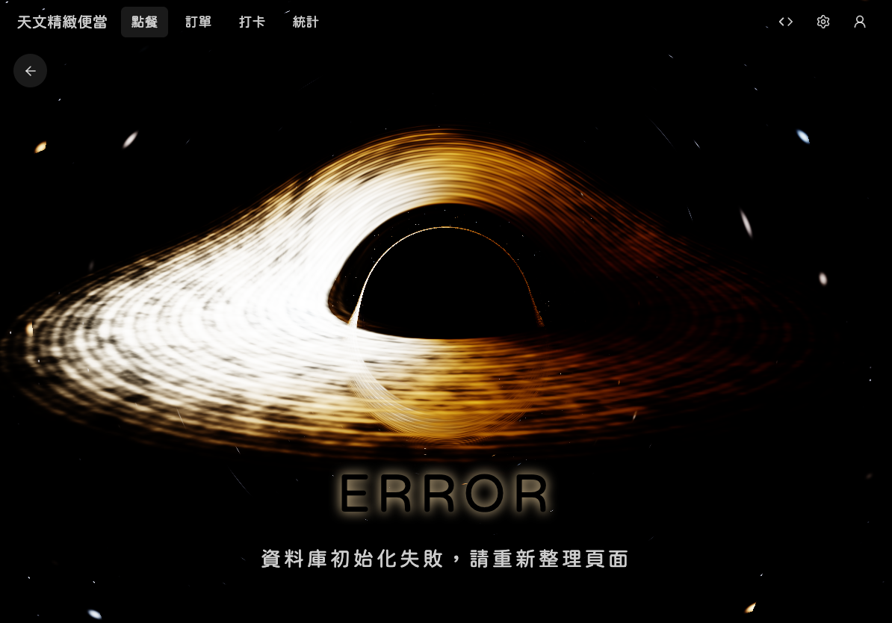
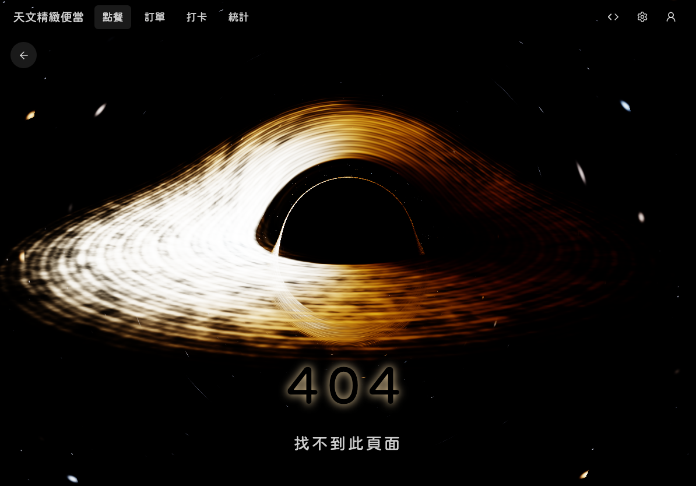
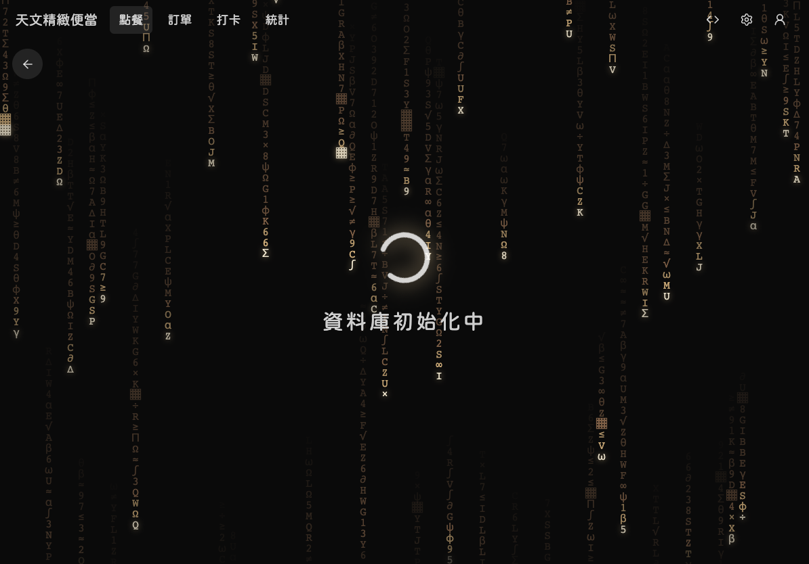
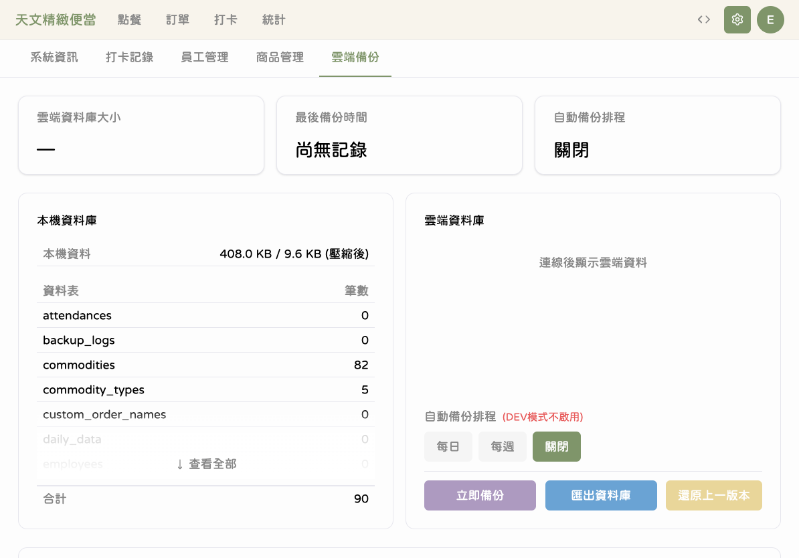
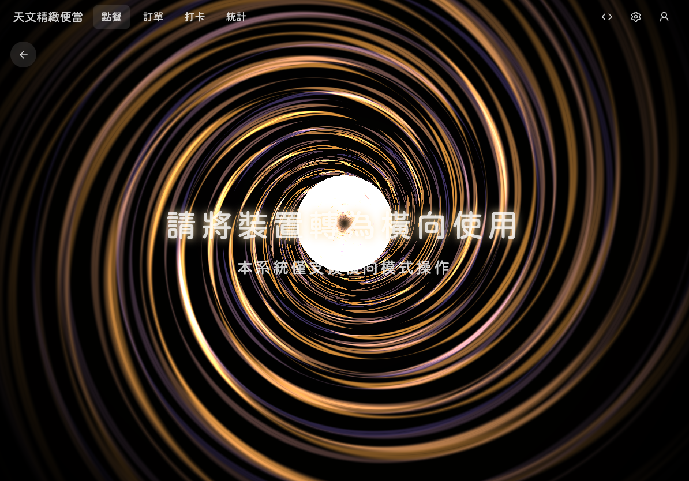

# 疑難排解

本章節列出使用過程中可能遇到的問題和解決方法。如果遇到下列畫面，請依照對應的處理步驟操作。

---

## 錯誤畫面（系統錯誤）

### 畫面說明

如果看到帶有動畫效果的錯誤畫面（Event Horizon 動畫），代表系統發生了非預期的錯誤。

### 處理步驟

1. **不要緊張**，您的資料都安全保存在本機資料庫中
2. **點擊**畫面上的「重新載入」或「回首頁」按鈕
3. 如果按鈕沒有反應，請直接**關閉應用程式**後重新開啟
4. 如果問題持續發生，請記錄畫面上顯示的錯誤訊息，並通知管理員

---

## 找不到頁面（404）

### 畫面說明

如果看到「找不到頁面」的提示，代表您嘗試訪問的網址不存在。

### 處理步驟

1. **點擊**「回首頁」按鈕，返回點餐主頁面
2. 如果是從書籤或連結進入的，請確認網址是否正確
3. 通常這是因為手動輸入了錯誤的網址，從導覽列選擇正確的頁面即可

---

## 載入畫面停留過久

### 畫面說明

開啟應用程式時，初始化畫面通常只會顯示 3-5 秒。如果超過 30 秒仍停留在載入畫面，可能是系統初始化遇到問題。

### 處理步驟

1. **等待至少 30 秒**，有時候第一次啟動或資料較多時會需要較長時間
2. 如果超過 30 秒，**關閉應用程式**後重新開啟
3. 如果重新開啟後仍然卡住：
   - 確認 iPad 有足夠的儲存空間
   - 確認網路連線正常
   - 嘗試在 Safari 中清除網站資料後重新開啟
4. 如果問題持續，請通知管理員

---

## 新版本通知

### 畫面說明

當系統有新版本可用時，畫面上會出現更新通知。

### 處理步驟

1. 看到「更新」按鈕時，請直接**點擊**更新
2. 系統會自動重新載入並套用新版本
3. 更新過程通常只需幾秒鐘，不會影響已儲存的資料
4. 如果選擇「稍後」，下次開啟應用程式時會再次提醒

建議盡快更新，新版本通常包含功能改善和問題修正。

---

## 備份失敗

### 畫面說明

執行備份時如果出現錯誤訊息，通常是網路連線問題。

### 處理步驟

1. **檢查網路連線** — 確認 iPad 的 Wi-Fi 是否正常連線
2. **重新嘗試** — 點擊「重試」按鈕或再次點擊「立即備份」
3. 如果持續失敗：
   - 確認 Wi-Fi 網路是否穩定（嘗試開啟其他網頁測試）
   - 確認不是在備份正在進行中又重複點擊
   - 等待幾分鐘後再試
4. 如果問題超過一天無法解決，請通知管理員

**您的資料安全嗎？** 備份失敗不會影響本機資料，所有訂單和記錄都安全保存在 iPad 上。只是這些資料尚未上傳到雲端。

---

## 請將裝置轉為直向

### 畫面說明

當 iPad 被轉為橫向（橫式）時，畫面會出現提示要求轉回直向。

### 處理步驟

1. **將 iPad 轉為直式**（Home 鍵或底部邊框朝下）
2. 提示畫面會自動消失，回到正常操作介面
3. 如果已經是直式但仍顯示提示，請嘗試將 iPad 先轉一圈再轉回來

天文 V2 僅支援直向模式，這是為了確保點餐介面的最佳使用體驗。

---

## 其他常見問題

### 應用程式反應很慢

- 關閉其他正在使用的應用程式，釋放記憶體
- 確認 iPad 的儲存空間還有剩餘
- 重新開啟天文 V2 應用程式

### 商品圖片沒有顯示

- 確認網路連線正常
- 重新整理頁面
- 如果特定商品一直沒有圖片，請通知管理員檢查商品設定

### 打卡按鈕沒有反應

- 確認點擊的是自己的員工卡片
- 等待幾秒後再試（系統可能正在處理中）
- 如果持續無反應，關閉應用程式後重新開啟

### 統計數據看起來不對

- 確認日期範圍選擇是否正確
- 重新整理頁面
- 如果剛送出訂單，等待幾秒讓系統更新統計

---

## 💡 小提醒

- 大部分問題都可以透過「關閉後重新開啟」來解決
- 遇到任何錯誤畫面時，您的資料都不會遺失
- 建議每天使用前先確認應用程式是否有更新通知
- 如果問題反覆出現，請記錄發生的時間和操作步驟，方便管理員排查

## ⚠️ 需要更多幫助？

如果以上方法都無法解決您的問題，請聯繫管理員，並提供以下資訊：

1. 問題發生的時間
2. 您正在執行什麼操作
3. 畫面上顯示的錯誤訊息（如果有的話）
4. 問題是否能重複發生
